<h3 align="center"> Universidad Peruana de Ciencias Aplicadas </h3>

<h3 align="center"> Ingeniería de Software </h3>
<h3 align="center"> Ciclo 2025 - 01 </h3>

 

  

 
<h3 align="center"> Desarrollo de Aplicaiones Open Source - 1ASI0729 </h3>
<h3 align="center"> Profesor del Curso: Castro Veramendi, Rafael Oswaldo </h3>
<h3 align="center"> "INFORME DE TRABAJO FINAL"</h3>
<h3 align="center"> EMPRESA DE INICIO: BuildPlanning </h3>

<h3 align="center"> PRODUCTO: IronGrid Systems </h3>

| Miembro                                |    Código     |
| :------------------------------------- | :-----------: |
| Pachas Chavez, Alejandro Alberto     | U201917598    |
| Rengifo Lozano, David   | U202221022   |
| Chavez Viera Joseph Manuel          | U202314019    |
| Estrada Cajamune Abraham Andres    |  U202112164   |
| Travezaño Patiño, Eduard Gedeon    | U20211A789  |
| Cueva Elera, Erick Armando          | U201910151     |

<h3 align="center"> 2025 </h3>

 

# **Registro de Versiones del Informe**

<table BORDER>
    <tr>
        <td>VERSION</td>
        <td>FECHA</td>
        <td> AUTOR </td>
        <td>DESCRIPCION DE MODIFICACION</td>
    </tr>
    <tr>
        <td>01</td>
        <td>25/04/2025</td>
        <td> Pachas Chavez, Alejandro Alberto,Rengifo Lozano, David,Chavez Viera Joseph Manuel,
        Estrada Cajamune Abraham Andres,
        Travezaño Patiño, Eduard Gedeon
 </td>
        <td>Elaboración del TB1</td>
    </tr>
    <tr>
        <td></td>
        <td></td>
        <td></td>
        <td></td>
    </tr>
    <tr>
        <td></td>
        <td></td>
        <td></td>
        <td></td>
    </tr>
</table>

# **Project Report Collaboration Insights**

URL del repositorio de la Organizacion: <https://github.com/TF-Open-Source>

# **Contenido**
### Tabla de contenidos
- [**Registro de Versiones del Informe**](#registro-de-versiones-del-informe)
- [**Project Report Collaboration Insights**](#project-report-collaboration-insights)
- [**Contenido**](#contenido)
    - [Tabla de contenidos](#tabla-de-contenidos)
- [**Student Outcome**](#student-outcome)
- [ **Capítulo I: Introducción** ](#-capítulo-i-introducción-)
  - [**1.1. Startup Profile**](#11-startup-profile)
    - [**1.1.1. Descripción de la Startup**](#111-descripción-de-la-startup)
    - [**1.1.2. Perfiles de integrantes del equipo**](#112-perfiles-de-integrantes-del-equipo)
  - [**1.2. Solution Profile**](#12-solution-profile)
    - [**1.2.1 Antecedentes y problemática**](#121-antecedentes-y-problemática)
    - [What (¿Qué?)](#what-qué)
    - [Who (¿Quién?)](#who-quién)
    - [Where (¿Dónde?)](#where-dónde)
    - [When (¿Cuándo?)](#when-cuándo)
    - [Why (¿Por qué?)](#why-por-qué)
    - [How (¿Cómo?)](#how-cómo)
    - [How much (¿Cuánto?)](#how-much-cuánto)
    - [**1.2.2 Lean UX Process**](#122-lean-ux-process)
    - [**1.2.2.1. Lean UX Problem Statements**](#1221-lean-ux-problem-statements)
    - [**1.2.2.2. Lean UX Assumptions**](#1222-lean-ux-assumptions)
    - [**1.2.2.3. Lean UX Hypothesis Statements**](#1223-lean-ux-hypothesis-statements)
    - [**1.2.2.4. Lean UX Canvas**](#1224-lean-ux-canvas)
  - [**1.3. Segmentos objetivo**](#13-segmentos-objetivo)
- [ **Capítulo II: Requirements Elicitation \& Analysis**](#-capítulo-ii-requirements-elicitation--analysis)
  - [**2.1. Competidores**](#21-competidores)
    - [**2.1.1. Análisis competitivo**](#211-análisis-competitivo)
    - [**2.1.2. Estrategias y tácticas frente a competidores**](#212-estrategias-y-tácticas-frente-a-competidores)
  - [**2.2. Entrevistas**](#22-entrevistas)
    - [**2.2.1. Diseño de entrevistas**](#221-diseño-de-entrevistas)
    - [**2.2.2. Registro de entrevistas**](#222-registro-de-entrevistas)
    - [**2.2.3. Análisis de entrevistas**](#223-análisis-de-entrevistas)
  - [**2.3. Needfinding**](#23-needfinding)
    - [**2.3.1. User Personas**](#231-user-personas)
    - [**2.3.2. User Task Matrix**](#232-user-task-matrix)
    - [**2.3.3. User Journey Mapping**](#233-user-journey-mapping)
    - [**2.3.4. Empathy Mapping**](#234-empathy-mapping)
    - [**2.3.5. As-is Scenario Mapping**](#235-as-is-scenario-mapping)
  - [**2.4. Ubiquitous Language**](#24-ubiquitous-language)
- [ **Capítulo III: Requirements Specification**](#-capítulo-iii-requirements-specification)
  - [**3.1. To-Be Scenario Mapping**](#31-to-be-scenario-mapping)
  - [**3.2. User Stories**](#32-user-stories)
  - [**3.3. Impact Mapping**](#33-impact-mapping)
  - [**3.4. Product Backlog**](#34-product-backlog)
- [**Capítulo IV: Product Design**](#capítulo-iv-product-design)
  - [**4.1. Style Guidelines**](#41-style-guidelines)
    - [**4.1.1. General Style Guidelines**](#411-general-style-guidelines)
    - [**4.1.2. Web Style Guidelines**](#412-web-style-guidelines)
  - [**4.2. Information Architecture**](#42-information-architecture)
    - [**4.2.1. Organization Systems**](#421-organization-systems)
    - [**4.2.2. Labeling Systems**](#422-labeling-systems)
    - [**4.2.3. SEO Tags and Meta Tags**](#423-seo-tags-and-meta-tags)
    - [**4.2.4. Searching Systems**](#424-searching-systems)
    - [**4.2.5. Navigation Systems**](#425-navigation-systems)
  - [**4.3. Landing Page UI Design**](#43-landing-page-ui-design)
    - [**4.3.1. Landing Page Wireframe**](#431-landing-page-wireframe)
    - [**4.3.2. Landing Page Mock-up**](#432-landing-page-mock-up)
  - [**4.4. Web Applications UX/UI Design**](#44-web-applications-uxui-design)
    - [**4.4.1. Web Applications Wireframes**](#441-web-applications-wireframes)
    - [**4.4.2. Web Applications Wireflow Diagrams**](#442-web-applications-wireflow-diagrams)
    - [**4.4.3. Web Applications Mock-ups**](#443-web-applications-mock-ups)
    - [**4.4.4. Web Applications User Flow Diagrams**](#444-web-applications-user-flow-diagrams)
  - [**4.5. Web Applications Prototyping**](#45-web-applications-prototyping)
  - [**4.6. Domain-Driven Software Architecture**](#46-domain-driven-software-architecture)
    - [**4.6.1. Software Architecture Context Diagram**](#461-software-architecture-context-diagram)
    - [**4.6.2. Software Architecture Container Diagrams**](#462-software-architecture-container-diagrams)
    - [**4.6.3. Software Architecture Components Diagrams**](#463-software-architecture-components-diagrams)
  - [**4.7. Software Object-Oriented Design**](#47-software-object-oriented-design)
    - [**4.7.1. Class Diagrams**](#471-class-diagrams)
    - [**4.7.2. Class Dictionary**](#472-class-dictionary)
  - [**4.8. Database Design**](#48-database-design)
    - [**4.8.1. Database Diagram**](#481-database-diagram)
- [**Capítulo V: Product Implementation, Validation \& Deployment**](#capítulo-v-product-implementation-validation--deployment)
  - [**5.1. Software Configuration Management**](#51-software-configuration-management)
    - [**5.1.1. Software Development Environment Configuration**](#511-software-development-environment-configuration)
    - [**5.1.2. Source Code Management**](#512-source-code-management)
    - [**5.1.3. Source Code Style Guide \& Conventions**](#513-source-code-style-guide--conventions)
    - [**5.1.4. Software Deployment Configuration**](#514-software-deployment-configuration)
  - [**5.2. Landing Page, Services \& Applications Implementation**](#52-landing-page-services--applications-implementation)
    - [**5.2.1. Sprint 1**](#521-sprint-1)
        - [**5.2.1.1. Sprint Planning 1**](#5211-sprint-planning-1)
        - [**5.2.1.2. Sprint Backlog 1**](#5212-sprint-backlog-1)
        - [**5.2.1.3. Development Evidence for Sprint Review**](#5213-development-evidence-for-sprint-review)
        - [**5.2.1.4. Testing Suite Evidence for Sprint Review**](#5214-testing-suite-evidence-for-sprint-review)
        - [**5.2.1.5. Execution Evidence for Sprint Review**](#5215-execution-evidence-for-sprint-review)
        - [**5.2.1.6. Services Documentation Evidence for Sprint Review**](#5216-services-documentation-evidence-for-sprint-review)
        - [**5.2.1.7. Software Deployment Evidence for Sprint Review**](#5217-software-deployment-evidence-for-sprint-review)
        - [**5.2.1.8. Team Collaboration Insights during Sprint**](#5218-team-collaboration-insights-during-sprint)
    - [**5.2.2. Sprint 2**](#522-sprint-2)
        - [**5.2.2.1. Sprint Planning 2**](#5221-sprint-planning-2)
        - [**5.2.2.2. Sprint Backlog 2**](#5222-sprint-backlog-2)
        - [**5.2.2.3. Development Evidence for Sprint Review**](#5223-development-evidence-for-sprint-review)
        - [**5.2.2.4. Testing Suite Evidence for Sprint Review**](#5224-testing-suite-evidence-for-sprint-review)
        - [**5.2.2.5. Execution Evidence for Sprint Review**](#5225-execution-evidence-for-sprint-review)
        - [**5.2.2.6. Services Documentation Evidence for Sprint Review**](#5226-services-documentation-evidence-for-sprint-review)
        - [**5.2.2.7. Software Deployment Evidence for Sprint Review**](#5227-software-deployment-evidence-for-sprint-review)
        - [**5.2.2.8. Team Collaboration Insights during Sprint**](#5228-team-collaboration-insights-during-sprint)
    - [**5.2.3. Sprint 3**](#523-sprint-3)
        - [**5.2.3.1. Sprint Planning 3**](#5231-sprint-planning-3)
        - [**5.2.3.2. Sprint Backlog 3**](#5232-sprint-backlog-3)
        - [**5.2.3.3. Development Evidence for Sprint Review**](#5233-development-evidence-for-sprint-review)
        - [**5.2.3.4. Testing Suite Evidence for Sprint Review**](#5234-testing-suite-evidence-for-sprint-review)
        - [**5.2.3.5. Execution Evidence for Sprint Review**](#5235-execution-evidence-for-sprint-review)
        - [**5.2.3.6. Services Documentation Evidence for Sprint Review**](#5236-services-documentation-evidence-for-sprint-review)
        - [**5.2.3.7. Software Deployment Evidence for Sprint Review**](#5237-software-deployment-evidence-for-sprint-review)
        - [**5.2.3.8. Team Collaboration Insights during Sprint**](#5238-team-collaboration-insights-during-sprint)
    - [**5.2.4. Sprint 4**](#524-sprint-4)
        - [**5.2.4.1. Sprint Planning 4**](#5241-sprint-planning-4)
        - [**5.2.4.2. Sprint Backlog 4**](#5242-sprint-backlog-4)
        - [**5.2.4.3. Development Evidence for Sprint Review**](#5243-development-evidence-for-sprint-review)
        - [**5.2.4.4. Testing Suite Evidence for Sprint Review**](#5244-testing-suite-evidence-for-sprint-review)
        - [**5.2.4.5. Execution Evidence for Sprint Review**](#5245-execution-evidence-for-sprint-review)
        - [**5.2.4.6. Services Documentation Evidence for Sprint Review**](#5246-services-documentation-evidence-for-sprint-review)
        - [**5.2.4.7. Software Deployment Evidence for Sprint Review**](#5247-software-deployment-evidence-for-sprint-review)
        - [**5.2.4.8. Team Collaboration Insights during Sprint**](#5248-team-collaboration-insights-during-sprint)
  - [**5.3. Validation Interviews**](#53-validation-interviews)
    - [**5.3.1. Diseño de Entrevistas**](#531-diseño-de-entrevistas)
    - [**5.3.2. Registro de Entrevistas**](#532-registro-de-entrevistas)
    - [**5.3.3. Evaluaciones según heurísticas**](#533-evaluaciones-según-heurísticas)
  - [**5.4. Video About-the-Product**](#54-video-about-the-product)
- [**Conclusiones**](#conclusiones)
- [**Conclusiones y recomendaciones**](#conclusiones-y-recomendaciones)
- [**Video About-the-Team**](#video-about-the-team)
- [**Bibliografía**](#bibliografía)
- [**Anexos**](#anexos)

# **Student Outcome**

#  **Capítulo I: Introducción** 
## **1.1. Startup Profile**
### **1.1.1. Descripción de la Startup**
 
<strong>Nombre de la Startup:</strong> IronGrid Systems

    
IronGrid Systems es una startup enfocada en transformar la gestión de tareas en equipos de construcción mediante herramientas tecnológicas innovadoras y adaptables. Su propósito es brindar soluciones eficientes que optimicen la planificación, coordinación y monitoreo de actividades en proyectos de construcción.

    
<h3>Solución y Propuesta Tecnológica</h3>
    
Nuestra plataforma digital permite a las empresas constructoras administrar tareas de manera organizada y mejorar la comunicación entre sus equipos. Para ello, IronGrid Systems integra:

<strong>Nombre de la Startup:</strong> IronGrid Systems

IronGrid Systems es una startup enfocada en transformar la gestión de tareas en equipos de construcción mediante herramientas tecnológicas innovadoras           y adaptables. Su propósito es brindar soluciones eficientes que optimicen la planificación, coordinación y monitoreo de actividades en proyectos de                construcción.

<h3>Solución y Propuesta Tecnológica</h3>

Nuestra plataforma digital permite a las empresas constructoras administrar tareas de manera organizada y mejorar la comunicación entre sus equipos. Para ello, IronGrid Systems integra:

<ul>

  <li><strong>Gestión Visual:</strong> Tableros interactivos para visualizar el progreso de las tareas.</li>
        <li><strong>Accesibilidad Multidispositivo:</strong> Interfaz intuitiva optimizada para uso tanto en oficina como en campo.</li>
        <li><strong>Integración con Servicios Externos:</strong> Conexiones con herramientas de logística y geolocalización.</li>
        <li><strong>Seguridad y Transparencia:</strong> Tecnologías open-source que garantizan estabilidad y escalabilidad.</li>
  </ul>

    <h3>Misión y Visión</h3>
    <h4>Misión</h4>
    
Facilitar la gestión de tareas en equipos de construcción mediante soluciones tecnológicas innovadoras que impulsen la productividad y la colaboración.

    <h4>Visión</h4>
    
Liderar la transformación digital en el sector de la construcción, ofreciendo herramientas confiables que optimicen los procesos y potencien la eficiencia operativa.

### **1.1.2. Perfiles de integrantes del equipo**    

Los integrantes del equipo de <strong>IronGrid Systems</strong> son seis alumnos especializados en el desarrollo de soluciones tecnológicas para la industria de la construcción. Cada miembro aporta su conocimiento y experiencia en áreas clave como desarrollo de software, gestión de proyectos, diseño UX/UI y administración de sistemas.

## **1.2. Solution Profile**
</ul>
<h3>Misión y Visión</h3>
<h4>Misión</h4>

Facilitar la gestión de tareas en equipos de construcción mediante soluciones tecnológicas innovadoras que impulsen la productividad y la colaboración.

<h4>Visión</h4>

Liderar la transformación digital en el sector de la construcción, ofreciendo herramientas confiables que optimicen los procesos y potencien la eficiencia operativa.

### **1.1.2. Perfiles de integrantes del equipo**
  
Los integrantes del equipo de <strong>IronGrid Systems</strong> son seis alumnos especializados en el desarrollo de soluciones tecnológicas para la industria de la construcción. Cada miembro aporta su conocimiento y experiencia en áreas clave como desarrollo de software, gestión de proyectos, diseño UX/UI y administración de sistemas.

## **1.2. Solution Profile**
### **1.2.1 Antecedentes y problemática**

En la industria de la construcción, la gestión de tareas y la coordinación entre equipos son elementos fundamentales para el éxito de un proyecto. Sin embargo, muchas empresas aún dependen de métodos tradicionales, como hojas de cálculo o comunicaciones fragmentadas, lo que genera desafíos importantes:

<ul>
    <li><strong>Falta de visibilidad en el progreso de las tareas:</strong> Sin una plataforma centralizada, los equipos tienen dificultades para monitorear el estado de las actividades en tiempo real.</li>
    <li><strong>Retrasos en la ejecución de proyectos:</strong> La falta de una organización eficiente provoca incumplimientos en plazos y sobrecostos imprevistos.</li>
    <li><strong>Desconexión entre campo y oficina:</strong> Los equipos en obra y los administradores de proyectos no siempre tienen acceso inmediato a la misma información, afectando la toma de decisiones.</li>
    <li><strong>Dificultad en la asignación de responsabilidades:</strong> Sin un sistema estructurado, la asignación de tareas y el seguimiento de cumplimiento pueden ser confusos e ineficaces.</li>
    <li><strong>Dependencia de procesos manuales:</strong> Muchas empresas constructoras aún utilizan papel, correos electrónicos y llamadas telefónicas para la gestión de tareas, lo que genera pérdida de información y errores humanos.</li>
    <li><strong>Fragmentación de la comunicación:</strong> La falta de una plataforma centralizada provoca dificultades en la transmisión de información entre distintos equipos y niveles de gestión.</li>
    <li><strong>Falta de análisis predictivo:</strong> Sin herramientas avanzadas, las constructoras tienen poca capacidad de anticipar retrasos o problemas antes de que afecten el proyecto.</li>
</ul>

IronGrid Systems busca resolver estos problemas a través de una plataforma digital optimizada para el sector de la construcción, permitiendo una gestión eficiente, colaborativa y en tiempo real.

### What (¿Qué?) -> ¿Qué problema existe en la gestión de tareas en la construcción?

El problema radica en la falta de herramientas eficientes para la gestión de tareas en la construcción. Las empresas enfrentan desorganización, pérdida de información y dificultades en la asignación de responsabilidades.

### Who (¿Quién?) -> ¿Quiénes son los afectados por este problema (usuarios objetivo)?

Los principales afectados son los equipos de construcción, desde operarios en obra hasta administradores de proyectos y gerentes, quienes experimentan problemas de comunicación y seguimiento de tareas.

### Where (¿Dónde?) -> ¿Dónde ocurre este problema (obra, oficina, comunicación interna)?

Este problema ocurre tanto en la obra como en la oficina. En campo, la información se pierde entre múltiples canales, y en la oficina, los responsables de planificación no tienen visibilidad clara del avance real.

 
### When (¿Cuándo?) -> ¿Cuándo se presenta el problema (planificación, ejecución)?

Surge en diferentes fases del proyecto: desde la planificación inicial hasta la ejecución y supervisión. Se acentúa cuando hay múltiples equipos trabajando en distintas ubicaciones sin un sistema centralizado.

### Why (¿Por qué?) -> ¿Por qué este problema afecta la eficiencia en la construcción?

La falta de una plataforma eficiente genera retrasos, sobrecostos y errores operativos. La construcción requiere precisión y coordinación, y sin herramientas adecuadas, las empresas pierden productividad y competitividad.

 
### How (¿Cómo?) -> ¿Cómo nuestra solución aborda este problema y mejora el proceso?

IronGrid Systems aborda este problema ofreciendo una plataforma digital intuitiva con gestión visual de tareas, integración de datos en tiempo real y comunicación eficiente entre equipos, mejorando la organización y ejecución de los proyectos.

 
### How much (¿Cuánto?) -> ¿Cuánto impacto tiene este problema en costos, tiempos y productividad?

La ineficiencia en la gestión de tareas puede generar costos adicionales de hasta un 20% en proyectos grandes, además de retrasos considerables en cronogramas, afectando la rentabilidad y la calidad de la obra.

 
### **1.2.2 Lean UX Process**
### 1.2.2.1. Lean UX Problem Statements
#### Problem Statement
#### Domain</h4>

La industria de la construcción enfrenta desafíos críticos en la gestión de tareas, planificación y coordinación de equipos. A pesar de la digitalización en otros sectores, muchas empresas constructoras aún dependen de procesos manuales, como hojas de cálculo y correos electrónicos, lo que dificulta la eficiencia operativa y genera retrasos en la ejecución de proyectos.

#### Customer Segments</h4>

Los principales usuarios de <strong>IronGrid Systems</strong> incluyen:

<ul>
    <li>Empresas constructoras que requieren una mejor coordinación entre equipos.</li>
    <li>Administradores de proyectos encargados de la planificación y ejecución de tareas.</li>
    <li>Supervisores e ingenieros que necesitan visibilidad sobre el estado de las tareas en tiempo real.</li>
    <li>Operarios de construcción que se benefician de una comunicación clara y estructurada sobre sus responsabilidades.</li>
</ul>

#### Pain Points</h4>

Actualmente, los equipos enfrentan problemas clave como:

<ul>
    <li>Falta de comunicación efectiva entre equipos de obra y oficina.</li>
    <li>Pérdida de información importante debido a métodos tradicionales de gestión.</li>
    <li>Retrasos y sobrecostos derivados de la desorganización en la ejecución de tareas.</li>
    <li>Ausencia de herramientas de monitoreo en tiempo real para la toma de decisiones.</li>
</ul>

#### Gap</h4>

El mercado carece de una solución especializada en construcción que integre gestión de tareas, comunicación y visualización de datos en un único entorno digital. Las herramientas actuales no están adaptadas a las dinámicas de obra y no resuelven eficientemente los problemas operativos del sector.

#### Visión/Estrategia</h4>

<strong>IronGrid Systems</strong> propone una plataforma digital intuitiva, accesible y optimizada para la industria de la construcción. Nuestra solución integra monitoreo en tiempo real, gestión visual de tareas y comunicación efectiva entre equipos, asegurando un flujo de trabajo estructurado y eficiente.

Además, IronGrid Systems está diseñado para <strong>garantizar la seguridad de la información</strong> y la <strong>compatibilidad con herramientas existentes</strong>, facilitando su adopción en diferentes empresas sin fricciones en el flujo de trabajo.

#### Initial Segment</h4>

Para validar la solución, los primeros usuarios incluirán <strong>empresas medianas y grandes</strong> de construcción, enfocándonos en administradores de proyectos y supervisores que buscan digitalizar su flujo de trabajo y reducir costos operativos.

Sabremos que esto es cierto cuando los usuarios reporten una <strong>mejor comunicación</strong>, <strong>reducción de errores operativos</strong> y <strong>optimización en tiempos de ejecución</strong>.

### 1.2.2.2. Lean UX Assumptions

#### Assumptions
<ul>
        <strong>-> Asumimos que</strong> los equipos de construcción necesitan una solución digital para mejorar la gestión de tareas.  
        <strong>
 -> Sabremos que esto es cierto cuando</strong> las empresas reporten una reducción en errores operativos y mayor eficiencia en la planificación

</ul>
<ul>
        <strong>-> Asumimos que</strong> la falta de comunicación entre obra y oficina genera retrasos y sobrecostos en los proyectos.  
        
<strong>-> Sabremos que esto es cierto cuando</strong> los equipos identifiquen mejoras en la coordinación y en la rapidez de la toma de decisiones tras implementar IronGrid Systems.

</ul>  
<ul>
        <strong> -> Asumimos que</strong> los administradores de proyectos buscan herramientas integradas que centralicen la planificación y el seguimiento.  
        
<strong> -> Sabremos que esto es cierto cuando</strong> los usuarios adopten la plataforma y reduzcan la dependencia de métodos tradicionales como hojas de cálculo y correos electrónicos. 
 
</ul>
<ul>
        <strong> -> Asumimos que</strong> la resistencia al cambio será un obstáculo en la adopción de la solución.  
        
<strong> -> Sabremos que esto es cierto cuando</strong> las empresas muestren dudas en la implementación o soliciten capacitaciones para facilitar la transición. 

</ul>

### **1.2.2.3. Lean UX Hypothesis Statements**

<ul>
    <li>
        <strong>Creemos que</strong> digitalizar la gestión de tareas en el sector construcción mejorará la productividad y reducirá los errores operativos.  
         <strong>Sabremos que esto es cierto cuando</strong> los equipos reporten menos retrasos en la ejecución de proyectos y un flujo de trabajo más estructurado.  
    </li>
    <li>
        <strong>Creemos que</strong> la integración de herramientas de comunicación en tiempo real facilitará la coordinación entre obra y oficina.  
         <strong>Sabremos que esto es cierto cuando</strong> los usuarios perciban una reducción en malentendidos y optimización en la asignación de responsabilidades.  
    </li>
    <li>
        <strong>Creemos que</strong> los administradores de proyectos adoptarán IronGrid Systems si la plataforma es intuitiva y fácil de implementar.  
         <strong>Sabremos que esto es cierto cuando</strong> las empresas reduzcan su dependencia de métodos tradicionales como hojas de cálculo y correos electrónicos.  
    </li>
    <li>
        <strong>Creemos que</strong> la resistencia al cambio será un desafío en la adopción de la solución.  
         <strong>Sabremos que esto es cierto cuando</strong> las empresas expresen dudas en la implementación o soliciten capacitaciones para facilitar la transición.  
    </li>
</ul>

##### 1.2.2.4. Lean UX Canvas
<table>
  <tr>
    <th valign="top">
      
1. Business Problem 

      
La industria de la construcción enfrenta problemas en la gestión de tareas, planificación y comunicación entre equipos, lo que ocasiona retrasos y sobrecostos.

    </th>
    <th valign="top">
      
<b>2. Business Outcomes</b>

      
- Optimizar la planificación y ejecución de proyectos de construcción.

      
- Reducir errores operativos y mejorar la coordinación entre obra y oficina.

      
- Disminuir tiempos de entrega y costos asociados.

      
- Incrementar la adopción de herramientas digitales para gestión de tareas.

    </th>
    <th rowspan="2" valign="top">
      
<b>5. Solutions</b>

      
- Plataforma digital de gestión de proyectos.

      
- Herramientas de comunicación en tiempo real y monitoreo visual.

    </th>
  </tr>
  <tr>
    <td valign="top">
      
<b>3. Users</b>

      
- Empresas constructoras.

      
- Administradores de proyectos.

      
- Supervisores e ingenieros.

    </td>
    <td valign="top">
      
<b>4. User Benefits</b>

      
- Mejor planificación y gestión de tareas.

      
- Comunicación fluida y centralizada entre equipos.

    </td>
  </tr>
  <tr>
    <td valign="top">
      
<b>6. Hypothesis</b>

      
- Creemos que digitalizar la gestión de tareas mejorará la productividad.

      
- Creemos que la comunicación en tiempo real optimizará la coordinación.

    </td>
    <td valign="top">
      
<b>7. What’s the most important thing we need to learn first?</b>

      
Cómo los equipos de construcción interactúan actualmente con herramientas digitales.

    </td>
    <td valign="top">
      
<b>8. What’s the least amount of work we need to do to learn the next most important thing?</b>

      
Realizar entrevistas con usuarios y pruebas piloto en entornos reales.

    </td>
  </tr>
</table>

## **1.3. Segmentos objetivo**

Para diseñar una solución efectiva, es esencial identificar los segmentos de usuarios que se beneficiarán de <strong>IronGrid Systems</strong>. La segmentación permite comprender mejor las necesidades de los clientes y ajustar la estrategia para maximizar el impacto del producto.

#### Segmentación Demográfica</h4>
<ul>
    <li><strong>Industria:</strong> Empresas constructoras, ingeniería civil y arquitectura.</li>
    <li><strong>Tamaño de empresa:</strong> Desde pequeñas constructoras hasta grandes corporaciones.</li>
    <li><strong>Ubicación:</strong> Operaciones en zonas urbanas y expansión hacia proyectos en áreas rurales.</li>
    <li><strong>Nivel educativo:</strong> Profesionales con formación técnica o universitaria en ingeniería civil, arquitectura o gestión de proyectos.</li>
</ul>

#### Información Estadística
<ul>
    <li>El 70% de las empresas constructoras reconoce la importancia de la automatización en la gestión de proyectos.</li>
    <li>El 45% de los administradores de proyectos indica que la falta de herramientas digitales genera retrasos en la planificación.</li>
    <li>Las soluciones de gestión digital pueden reducir los costos operativos entre un 15% y 25%, mejorando la eficiencia del trabajo en obra.</li>
</ul>

#### Segmentación Psicográfica
<ul>
    <li><strong>Intereses:</strong> Optimización de procesos, reducción de costos y digitalización de tareas.</li>
    <li><strong>Hábitos tecnológicos:</strong> Empresas abiertas a la innovación con interés en herramientas digitales.</li>
    <li><strong>Resistencia al cambio:</strong> Algunos segmentos requieren capacitación para la adopción de nuevas tecnologías.</li>
</ul>

#### Segmentación Conductual
<ul>
    <li><strong>Uso de tecnología:</strong> Empresas que ya utilizan software de gestión pero buscan una solución más eficiente.</li>
    <li><strong>Patrones de compra:</strong> Organizaciones con presupuestos destinados a herramientas digitales para mejorar la productividad.</li>
</ul>

#### Actores Involucrados
<ul>
    <li><strong>Empresas constructoras y administradores de proyectos:</strong> Son los principales usuarios del sistema, responsables de la gestión y planificación de obras. Buscan optimizar la comunicación, reducir errores operativos y mejorar la eficiencia en la ejecución de tareas.</li>
    <li><strong>Equipos de obra y supervisores:</strong> Son quienes ejecutan las tareas en el sitio de construcción. Necesitan acceso a información clara en tiempo real, asegurando que los proyectos se completen dentro de los plazos y presupuestos establecidos.</li>
</ul>

#### Conclusión

La correcta identificación de los segmentos objetivo de <strong>IronGrid Systems</strong> es esencial para garantizar que la solución tecnológica responda a las necesidades reales de la industria de la construcción. Al analizar las características demográficas, psicográficas y conductuales de los usuarios, junto con los actores clave involucrados en la implementación, se establece una base sólida para la adopción y el éxito del sistema.

La digitalización del sector construcción es una tendencia en crecimiento, y <strong>IronGrid Systems</strong> busca posicionarse como una herramienta clave para mejorar la productividad, reducir costos operativos y optimizar la coordinación entre los equipos de obra y oficina. Comprender a los usuarios permitirá diseñar estrategias efectivas para la implementación, capacitación y expansión de la plataforma.

 
#  **Capítulo II: Requirements Elicitation & Analysis**
## **2.1. Competidores**
### **2.1.1. Análisis competitivo**

<TABLE BORDER style="width:100%">
    <tr>
        <th colspan="6"> Competitive Analysis Landscape</th>
    </tr>
    <tr>
        <td rowspan="2">
            ¿Por qué llevar a cabo este análisis?
        </td>
        <td colspan="5"> 
        Escriba en el recuadro la pregunta que busca responder o el objetivo de este análisis. 
        </td>
    </tr>
    <tr>
        <td colspan="5"></td>
    </tr>
    <tr>
        <td colspan="2">
            (En la cabecera colocar por cada competidor nombre y logo)
        </td>
        <td> IronGrid </td>
        <td> Fieldwire </td>
        <td> Buildertrend </td>
        <td> Procore </td>
    </tr>
    <tr>
        <th rowspan="2"> Perfil</th>
        <td>Overview</td>
        <td>Plataforma que transforma la gestión de tareas en la construcción, diseñada para trabajadores de campo en empresas medianas.</td>
        <td>Una plataforma centrada en la gestión de tareas en obra, planos, inspecciones y comunicación para equipos de construcción</td>
        <td>Un software de gestión de la construcción integral,
            diseñado especificamente para constructores residenciales, remodeladores y contratistas.</td>
        <td>Una plataforma de gestión de la construcción robusta y ampliamente utilizada en proyectos comerciales, industriales y residenciales</td>
    </tr>
    <tr>
        <td>
            Ventaja competitiva ¿Qué valor ofrece a los clientes?
        </td>
        <td>Solución ligera, open-source, centrada en campo, accesible y colaborativa.</td>
        <td>Interfaz intuitiva, productividad en obra, gestión de planos.</td>
        <td>Gestión integral para residencial, portal para clientes.</td>
        <td>Plataforma completa, escalable para proyectos grandes.</td>
    </tr>
    <tr>
        <th rowspan="2"> Perfil de Marketing</th>
        <td>Mercado objetivo</td>
        <td>Constructoras medianas, mercados emergentes.</td>
        <td>Constructoras pequeñas a grandes, proyectos comerciales.</td>
        <td>Constructores residenciales, contratistas pequeños a medianos.</td>
        <td>Constructoras grandes, proyectos comerciales/industriales.</td>
    </tr>
    <tr>
        <td>
            Estrategias de marketing
        </td>
        <td>SEO, contenido educativo, freemium, comunidad open-source.</td>
        <td>Anuncios LinkedIn, ferias, pruebas gratuitas, blogs técnicos.</td>
        <td>Redes sociales, ferias locales, referidos, contenido para PYMES.</td>
        <td>Marketing empresarial, eventos globales, casos de éxito.</td>
    </tr>
    <tr>
        <th rowspan="3"> Perfil de Producto</th>
        <td>Productos & Servicios</td>
        <td>Gestión de tareas, plantillas comunitarias, soporte, integraciones básicas.</td>
        <td>Tareas, planos, inspecciones, soporte, integraciones.</td>
        <td>Proyectos, CRM, finanzas, soporte, integraciones financieras.</td>
        <td>Proyectos, finanzas, seguridad, soporte, integraciones avanzadas.</td>
    </tr>
    <tr>
        <td>
            Precios & Costos
        </td>
        <td>Freemium, $10-$30/usuario/mes.</td>
        <td>$29-$59/usuario/mes.</td>
        <td>$99-$699/mes (por proyectos).</td>
        <td>$50-$100/usuario/mes (cotización).</td>
    </tr>
    <tr>
        <td>
            Canales de distribución (Web y/o Móvil)
        </td>
        <td></td>
        <td>Web, móvil, ventas directas, partners.</td>
        <td>Web, móvil, ventas directas, asociaciones.</td>
        <td>Web, móvil, ventas empresariales, partners ERP.</td>
    </tr>
    <tr>
        <th rowspan="5"> Análisis SWOT</th>
        <td colspan="5">
        Realice esto para su startup y sus competidores. Sus fortalezas deberían apoyar sus oportunidades y contribuir a lo que ustedes definen como su posible ventaja competitiva. 
        </td>
    </tr>
    <tr>
        <td>
            Fortalezas
        </td>
        <td>funcionalidades centradas en campo (anotaciones offline, micro-planificación), comunidad colaborativa, bajo costo.</td>
        <td>Interfaz intuitiva, enfoque en campo, adopción rápida, soporte para múltiples idiomas.</td>
        <td>Enfoque en residencial, portal para clientes, integración financiera, facilidad de uso.</td>
        <td>Plataforma completa, escalabilidad, integraciones avanzadas, reconocimiento de marca.</td>
    </tr>
    <tr>
        <td>
            Debilidades
        </td>
        <td>Falta de reconocimiento de marca, recursos limitados como startup, curva de adopción para usuarios no técnicos.</td>
        <td>Menor profundidad en gestión financiera o de recursos comparado con Procore, dependencia de suscripciones.</td>
        <td>Menor aplicabilidad en proyectos comerciales grandes, funciones de campo menos robustas que Fieldwire.</td>
        <td>Complejidad y alto costo, menos accesible para empresas pequeñas, curva de aprendizaje.</td>
    </tr>
    <tr>
        <td>
           Oportunidades
        </td>
        <td>Creciente digitalización en mercados emergentes, demanda de soluciones económicas, potencial para expandir la biblioteca comunitaria.</td>
        <td>Expansión a mercados emergentes, integración con nuevas tecnologías (BIM).</td>
        <td>Crecimiento en mercados residenciales emergentes, adopción de BIM para diseño.</td>
        <td>Expansión a nuevos mercados, integración con tecnologías emergentes (IA, IoT).</td>
    </tr>
    <tr>
        <td>
            Amenazas
        </td>
        <td>Competencia de plataformas establecidas (Procore, Fieldwire), riesgo de baja adopción si no se comunica bien el valor open-source.</td>
        <td>Competencia de Procore y soluciones económicas como IronGrid, presión por bajar precios.</td>
        <td>Competencia de Procore en proyectos grandes, soluciones económicas como IronGrid.</td>
        <td>Competencia de soluciones económicas como IronGrid, presión por reducir costos.</td>
    </tr>
</TABLE>

### **2.1.2. Estrategias y tácticas frente a competidores**
Teniendo identificados las fortalezas, debilidades, oportunidades y amenazas de nuestros principales competidores.
Plantearemos las estrategias y tácticas frente a ellos:

**Afrontando las fortalezas de nuestros competidores**
**Estrategia:**
  Brindar un sistema de gestión de tareas intuitivo y accesible que sea personalizable para roles específicos, manteniendo un costo bajo gracias al modelo open-source, mientras se ofrece una calidad comparable a competidores establecidos como Procore y Fieldwire.

**Tácticas:**
 - Desarrollar una interfaz pulida y fácil de usar, optimizada para los dispositivos móviles y de escritorio, con botones grandes y alto contraste para uso en obra.
 - Ofrecer un modelo freemium con funciones básicas gratuitas y suscripciones premium a un costo reducido, manteniendo la calidad del sistema mediante actualizaciones comunitarias

**Afrontando las debilidades de nuestros competidores**
**Estrategia:**
  Brindar un sistema que se especialice en las necesidades de empresas constructoras medianas, abarcando roles específicos, con una interfaz amigable y práctica que no requiera capacitación extensa, a diferencia de competidores como Procore y Autodesk Construction Cloud.

**Tácticas:**
 - Desarrollar una interfaz simple y práctica, con incorporación en menos de 5 minutos y ayuda contextual en varios idiomas.
 - Diseñar el sistema especializado en constructoras medianas, con funcionalidades como anotaciones sin conexión, tableros por rol y micro-planificación diaria, resolviendo problemas específicos que competidores no abordan.

**Afrontando las oportunidades de nuestros competidores**
**Estrategia:**
 Atraer usuarios potenciales de la competencia, especialmente de Fieldwire y Buildertrend, que buscan soluciones más accesibles y personalizables.

**Tácticas:**
  - Publicitarnos en plataformas conocidas como LinkedIn, X (antes twitter) y foros de construcción, destacando testimonios de usuarios y el modelo open-source.
  - Ofrecer talleres gratuitos en comunidades de construcción para mostrar las ventajas de IronGrid frente a competidores.

**Afrontando las amenazas de nuestros competidores**
**Estrategia:**
Mantener actualizaciones constantes y una cobertura internacional para competir con la escalabilidad de competidores como Procore.

**Tácticas:**
 - Realizar actualizaciones al aparecer cualquier fallo, aprovechando la agilidad del modelo open-source y la comunidad para iterar rápidamente.
 - Expandir la cobertura internacional con soporte multilingüe y plantillas adaptadas a normativas locales, empezando por mercados emergentes como América Latina.

## **2.2. Entrevistas**
### **2.2.1. Diseño de entrevistas**
**Obreros y Capataces.**
**Preguntas demográficas**
- ¿Cuál es tu nombre?
- ¿Qué edad tienes?
- ¿Cuál es tu rol en la obra (obrero, capataz, otro)?
- ¿En qué región o distrito trabajas habitualmente?

**Preguntas Principales:**
- ¿Qué herramientas o métodos usas actualmente para organizar y seguir tus tareas diarias en la obra? ¿Usas alguna aplicación o dispositivo móvil? ¿Cuál es?
- ¿Cuánto tiempo te toma coordinar tus tareas diarias con el equipo (por ejemplo, asignar trabajos, revisar planos)?
- ¿Cuáles son las tareas que más tiempo te toman completar? ¿Por qué crees que ocurre esto?
- ¿Alguna vez han tenido problemas en la obra relacionados con la coordinación de tareas o comunicación con el equipo? ¿De qué trató el problema?
- ¿Has tenido dificultades para acceder a información (como planos, notas, o asignaciones) mientras estás en obra, especialmente en áreas sin conexión a internet? ¿Cómo lo solucionaste?

**Preguntas sobre el proyecto:**
- ¿Has escuchado de una aplicación que brinde servicios similares a los que ofrece IronGrid Systems, como gestión de tareas sin conexión o tableros por rol?
- ¿Crees que nuestra aplicación podría resolver los problemas que enfrentas en la gestión de tareas en obra?
- Al conocer las funcionalidades de IronGrid (como anotaciones sin conexión, micro-planificación diaria, biblioteca de plantillas), ¿qué otras características te gustaría ver en nuestra aplicación?

**Gerentes de Proyecto: **
**Preguntas demográficas**
- ¿Cuál es tu nombre?
- ¿Qué edad tienes?
- ¿Cuántos proyectos sueles supervisar al mismo tiempo?
- ¿En qué región o distrito operas principalmente?

**Preguntas Principales:**
- ¿Cómo manejas actualmente la planificación y seguimiento de tareas en tus proyectos de construcción?
- ¿Cuáles son los principales desafíos que enfrentas al coordinar equipos y recursos en obra?
- ¿Utilizas algún sistema o herramienta para hacer seguimiento del progreso de las tareas? ¿Cuánto tiempo toma actualizar y revisar este progreso?
- ¿Has enfrentado retrasos en proyectos debido a problemas de comunicación o dependencias entre tareas? ¿Cómo los manejaste?

**Preguntas sobre el proyecto:**
- ¿Has escuchado de alguna aplicación o plataforma que facilite la gestión de tareas en obra, como IronGrid Systems?
- ¿Qué características o funcionalidades te gustaría ver en una aplicación diseñada para ayudar a gerentes de proyecto a coordinar tareas y equipos?
- ¿Estarías interesado en probar una versión beta de IronGrid Systems y proporcionar retroalimentación sobre su funcionalidad y usabilidad?
- ¿Qué expectativas tienes en cuanto a costos y beneficios para utilizar una plataforma como la nuestra en tus proyectos?
### **2.2.2. Registro de entrevistas**
### **2.2.3. Análisis de entrevistas**
A continuación, se presenta el análisis de las entrevistas simuladas realizadas a tres usuarios clave de IronGrid Systems: un obrero, un jefe de obra y un gerente. Las respuestas se basan en el contexto de la industria de la construcción y las preguntas definidas en la sección 3.5 del informe. El objetivo es identificar necesidades, retos y oportunidades para el diseño del producto.

**Entrevistado 1: Obrero (Carlos Morales, 35 años, 10 años de experiencia)**
Respuestas

¿Qué tipo de tareas realizas diariamente en tu trabajo?
"Todos los días estoy en obra, normalmente haciendo tareas como excavación, mezcla de concreto, instalación de tuberías o armado de estructuras. Depende del proyecto, pero siempre son tareas físicas que me asigna el jefe de obra por la mañana."

¿Cómo te comunicas con tu equipo o supervisor durante el día?
"Hablo directamente con mi jefe de obra cuando está en el sitio. Si no está, a veces le envío un mensaje por WhatsApp o le llamo por teléfono. Entre el equipo, nos gritamos o usamos señas porque hay mucho ruido."

¿Qué herramientas o métodos utilizas para mantener un registro de tus tareas?
"No uso nada formal. El jefe de obra me dice qué hacer y yo lo apunto en un cuaderno o en mi celular si es algo importante. A veces se me olvida y tengo que preguntarle otra vez."

¿Qué tan fácil o difícil es para ti acceder a la información sobre tus tareas diarias?
"Es un poco difícil porque dependo de lo que me diga el jefe. Si no está, no sé qué hacer. Además, a veces no tengo señal en el sitio para buscar algo en el celular, y los planos que me dan en papel no siempre están actualizados."

¿Qué desafíos enfrentas al realizar tus tareas asignadas?
"El mayor problema es cuando falta material o herramientas, y no me avisan con tiempo. También, si hay cambios en las tareas y no me entero, pierdo tiempo. Y trabajar sin internet en sitios remotos es complicado porque no puedo buscar información o hablar con alguien rápido."

Análisis

Tareas Diarias (Pregunta 1): Los obreros realizan tareas físicas variadas (excavación, instalación, armado), lo que indica que necesitan una interfaz simple y visual para consultar sus asignaciones sin complicaciones.

Comunicación (Pregunta 2): La comunicación depende de métodos informales (WhatsApp, gritos, señas), lo que sugiere la necesidad de un sistema de chat integrado en la aplicación para facilitar la comunicación en tiempo real, incluso con ruido ambiental (notificaciones visuales).

Registro de Tareas (Pregunta 3): La falta de un sistema formal (uso de cuadernos o memoria) implica que los obreros se beneficiarían de una herramienta digital que centralice las tareas y permita registrar avances fácilmente.

Acceso a Información (Pregunta 4): La dificultad para acceder a información actualizada, especialmente sin conexión, resalta la importancia de la funcionalidad offline (anotaciones, planos precargados) y notificaciones claras sobre cambios.

Desafíos (Pregunta 5): Los retrasos por falta de materiales y la desconexión en sitios remotos son problemas clave. Esto refuerza la necesidad de un sistema que permita reportar incidencias rápidamente y funcione sin internet.

Hallazgos Clave:

Necesidad de una interfaz simple con tareas claras y visuales.

Funcionalidad offline crítica para sitios remotos.

Sistema de comunicación integrado para evitar métodos informales.

Reporte de incidencias (falta de materiales, cambios) en tiempo real.

**Entrevistado 2: Jefe de Obra (Ana Gómez, 42 años, 15 años de experiencia)**

Respuestas

¿Cómo asignas tareas a tu equipo y cómo haces seguimiento de su progreso?
"Cada mañana reúno al equipo y les digo qué hacer, según el plan que me pasa el gerente. Para el seguimiento, voy pasando por la obra y les pregunto cómo van. A veces uso una hoja de Excel en mi laptop, pero es difícil actualizarla en el momento."

¿Qué tan frecuentemente enfrentas retrasos en los proyectos y cómo los manejas?
"Los retrasos pasan casi todas las semanas. Normalmente son por falta de materiales o porque una tarea previa no se terminó a tiempo. Intento reprogramar las tareas y hablo con el gerente para ajustar el plan, pero es un proceso lento porque no tengo toda la información a la mano."

¿Qué herramientas utilizas para planificar y coordinar las actividades diarias?
"Uso Excel para hacer un cronograma y WhatsApp para hablar con el equipo y el gerente. También tengo una pizarra en la oficina de la obra para anotar las tareas del día, pero no siempre está actualizada."

¿Cómo te comunicas con los obreros y los gerentes?
"Con los obreros hablo en persona o por WhatsApp si estoy fuera de la obra. Con el gerente, normalmente por correo o WhatsApp también. A veces hay malentendidos porque los mensajes no son claros o se pierden."

¿Qué aspectos de tu trabajo te gustaría mejorar con una herramienta digital?
"Me gustaría tener una forma más rápida de asignar tareas y ver cómo va todo sin tener que caminar por toda la obra. También quisiera ver los retrasos y sus impactos de forma clara, y poder hablar con todos desde un solo lugar sin depender de WhatsApp."

Análisis

Asignación y Seguimiento (Pregunta 1): La asignación manual y el seguimiento presencial son ineficientes. Una herramienta digital con tableros kanban (por rol) y notificaciones de progreso ayudaría a agilizar el proceso.

Retrasos (Pregunta 2): Los retrasos son frecuentes y la reprogramación es lenta debido a la falta de visibilidad. Un visualizador de dependencias entre tareas y alertas de retrasos sería útil para anticipar problemas.

Herramientas de Planificación (Pregunta 3): El uso de Excel y pizarras indica una falta de herramientas integradas. Una funcionalidad de micro-planificación diaria (calendario) y tableros actualizados en tiempo real sería ideal.

Comunicación (Pregunta 4): La dependencia de WhatsApp y correo genera malentendidos. Un sistema de chat integrado en la plataforma, con mensajes claros y organizados, mejoraría la comunicación.

Mejoras Deseadas (Pregunta 5): La necesidad de visibilidad (progreso, retrasos) y comunicación centralizada resalta la importancia de tableros por rol, visualización de dependencias y un sistema de mensajería interno.

Hallazgos Clave:

Necesidad de tableros kanban para asignar y rastrear tareas.

Visualizador de dependencias para manejar retrasos.

Micro-planificación diaria para coordinar actividades.

Chat integrado para mejorar la comunicación con obreros y gerentes.

**Entrevistado 3: Gerente (Luis Ramírez, 50 años, 20 años de experiencia)**
Respuestas

¿Cómo supervisas el progreso general de los proyectos?
"Pido reportes semanales a los jefes de obra y los reviso en reuniones. También uso un software de gestión de proyectos, pero no es muy intuitivo y me toma tiempo entender los datos. A veces visito las obras para ver cómo va todo."

¿Qué tan importante es para ti visualizar las dependencias entre tareas?
"Es muy importante. Si una tarea se retrasa, quiero saber cómo afecta al resto del proyecto para tomar decisiones rápidas, como asignar más recursos. Ahora mismo, dependo de los reportes del jefe de obra, y no siempre tengo esa información clara."

¿Qué métricas o reportes utilizas para tomar decisiones?
"Me interesa el porcentaje de avance por etapa, los retrasos por tarea y el rendimiento de los equipos. Uso hojas de Excel que me pasa el jefe de obra, pero me gustaría tener reportes más visuales y actualizados al momento."

¿Qué desafíos enfrentas al coordinar múltiples equipos o proyectos?
"El mayor desafío es la falta de comunicación entre equipos. A veces un equipo no sabe que otro está retrasado, y eso genera más problemas. También es difícil tener una visión general de todos los proyectos a la vez."

¿Qué características esperas de una herramienta de gestión de proyectos?
"Quiero algo que me muestre el progreso en tiempo real, con gráficos claros de dependencias y retrasos. También me gustaría generar reportes automáticos y poder comunicarme con los jefes de obra directamente desde la herramienta."

Análisis

Supervisión (Pregunta 1): La supervisión actual es manual y lenta (reuniones, reportes semanales). Una herramienta con tableros en tiempo real y métricas visuales (gráficos) mejoraría la eficiencia.

Dependencias (Pregunta 2): La visualización de dependencias es crítica para la toma de decisiones. Un visualizador de dependencias interactivo (gráfico de nodos) permitiría identificar impactos rápidamente.

Métricas y Reportes (Pregunta 3): El gerente necesita métricas visuales y actualizadas (avance, retrasos, rendimiento). La funcionalidad de reportes automáticos con gráficos (barras, líneas) sería muy útil.

Coordinación (Pregunta 4): La falta de comunicación entre equipos genera retrasos en cascada. Un sistema de notificaciones y chat integrado ayudaría a mantener a todos alineados.

Características Deseadas (Pregunta 5): Las expectativas incluyen progreso en tiempo real, visualización clara y comunicación directa. Esto valida la necesidad de tableros, visualización de dependencias, reportes automáticos y un sistema de mensajería.

Hallazgos Clave:

Necesidad de tableros en tiempo real con métricas visuales.

Visualizador de dependencias interactivo para decisiones rápidas.

Reportes automáticos con gráficos claros (avance, retrasos).

Comunicación integrada para coordinar equipos.

**Conclusiones Generales**

Necesidades Comunes

Comunicación Eficiente: Todos los roles dependen de métodos informales (WhatsApp, reuniones presenciales), lo que genera malentendidos y retrasos. Un sistema de chat integrado es esencial.

Visibilidad en Tiempo Real: Obreros, jefes de obra y gerentes necesitan información actualizada (tareas, retrasos, dependencias). Esto valida el diseño de tableros por rol y notificaciones.

Funcionalidad Offline: Los obreros, que trabajan en sitios remotos, requieren acceso a tareas y planos sin conexión, lo que refuerza la importancia de esta característica.

Retos Principales

Falta de Centralización: Los métodos actuales (Excel, cuadernos, pizarras) no están integrados, lo que genera ineficiencias. IronGrid Systems debe centralizar tareas, comunicación y reportes.

Retrasos y Dependencias: Los retrasos son frecuentes y afectan a todos los roles. Un visualizador de dependencias y alertas automáticas ayudarían a mitigar estos problemas.

Acceso a Información: La dificultad para acceder a datos actualizados (especialmente sin conexión) es un problema recurrente, especialmente para obreros.

Oportunidades para IronGrid Systems

Interfaz Intuitiva: Diseñar una interfaz simple para obreros (botones grandes, visual), con tableros kanban para jefes de obra y gráficos para gerentes.

Comunicación Integrada: Implementar un chat en tiempo real para reducir la dependencia de herramientas externas.

Soporte Offline: Asegurar que las funcionalidades clave (tareas, planos, reportes de incidencias) estén disponibles sin conexión.

Automatización: Incluir reportes automáticos y alertas de retrasos para agilizar la toma de decisiones.

Visualización de Dependencias: Proporcionar un gráfico interactivo que muestre cómo los retrasos afectan otras tareas, beneficiando especialmente a gerentes y jefes de obra.

## **2.3. Needfinding**
### **2.3.1. User Personas**
**Segmento 1:** Obrero de Constructura.  
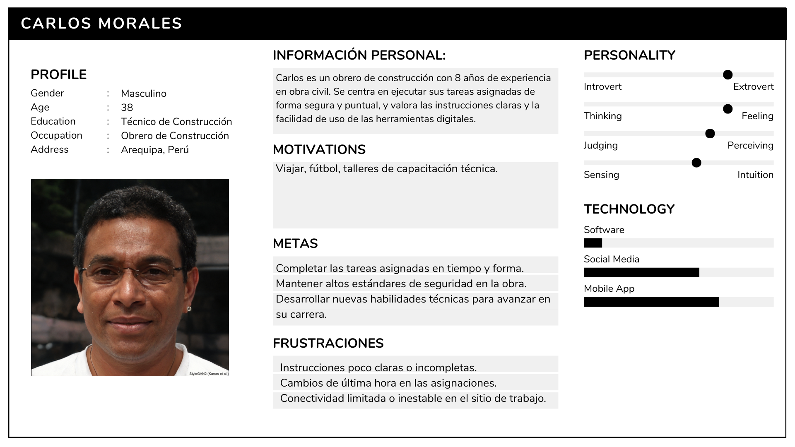

**Segmento 2:** Jefe de Obras de Constructura.

### **2.3.2. User Task Matrix**

# User Task Matrix

## Usuario: Carlos Morales (Obrero)

| Tareas                                    | Objetivos de las tareas                                          | Soporte de BuildPlanning                                                                                         |
| :----------------------------------------: | :---------------------------------------------------------------: | :---------------------------------------------------------------------------------------------------------------- |
| Ver lista de tareas asignadas             | Conocer qué debe hacer cada día y en qué orden                   | Panel principal con notificaciones push y lista ordenada por fecha y prioridad                                    |
| Actualizar estado de una tarea            | Informar progreso real (iniciado, en curso, completado)           | Botones rápidos para cambiar estado y sincronización automática, incluso en modo offline                         |
| Reportar incidencia o bloqueo en obra      | Alertar al jefe sobre problemas que impidan continuar             | Formulario integrado para adjuntar fotos, comentarios y ubicación GPS; notifica inmediatamente al Jefe de Obras  |
| Consultar detalles e instrucciones         | Asegurar que entiende bien los requisitos y normas de seguridad   | Fichas de tarea con descripciones, planos y manuales descargables para consulta sin conexión                     |
| Comunicar dudas o comentarios              | Mantener flujo de comunicación y resolver dudas al instante       | Chat interno o sección de comentarios en cada tarea con alertas al Jefe de Obras                                 |

## Usuario: María Fernández (Jefe de Obras)

| Tareas                                      | Objetivos de las tareas                                        | Soporte de BuildPlanning                                                                                              |
| :------------------------------------------: | :-------------------------------------------------------------: | :--------------------------------------------------------------------------------------------------------------------- |
| Asignar tareas a obreros                    | Distribuir trabajo de forma equilibrada y según habilidades    | Interfaz drag‑&‑drop para crear y asignar tareas a cada obrero con fechas, prioridad y recursos                       |
| Reprogramar o actualizar plazos             | Ajustar cronograma ante imprevistos y evitar retrasos          | Calendario interactivo que permite mover tareas y notifica automáticamente a los obreros afectados                     |
| Eliminar o archivar tareas completadas      | Mantener el tablero limpio y enfocarse en lo pendiente         | Opción de “archivar” con registro de métricas (tiempo invertido, fotos finales) y filtros para ver histórico            |
| Monitorear progreso en tiempo real          | Tener visibilidad constante del avance y detectar cuellos       | Dashboard con indicadores de estado (completado/en curso/incidencias) y mapa de obra con ubicación de cada tarea       |
| Generar reportes de avance y cumplimiento   | Facilitar la toma de decisiones y reportar a la gerencia       | Generador automático de informes PDF o Excel con gráficas de progreso, tiempos de ejecución y alertas de desviación    |

### **2.3.3. User Journey Mapping**
**Registration (Registro):**  
Why would they trust us?  
- Investigan sobre BuildPlanning antes de registrarse.  
- Leen recomendaciones de otros obreros o jefes de obra que ya la usan.  
- Verifican que la plataforma cuenta con respaldo de su empresa o supervisor directo.

**Onboarding and first use (Incorporación y primer uso):**  
How can they feel successful?  
- Completan un registro simple con acceso a través de su correo o ID de empleado.  
- La interfaz inicial les da una visión clara de sus tareas o capacidades de gestión.  
- Reciben una guía rápida sobre cómo asignar tareas (jefe) o revisar asignaciones (obrero).

**Daily Use (Uso diario):**  
How can they maintain engagement?  
- Visualizan el progreso de tareas en tiempo real.  
- Reciben recordatorios o actualizaciones de tareas importantes.  
- Pueden reportar incidencias o pedir ayuda desde la app fácilmente.

**Problem Solving (Resolución de problemas):**  
How can we help them overcome frustration?  
- El soporte técnico está disponible con solo un clic dentro de la plataforma.  
- La documentación o FAQ es accesible e incluye ejemplos claros.  
- Pueden comunicarse con su equipo directamente desde la aplicación.

**Sharing (Compartir o recomendar):**  
Why would they invite others?  
- Jefes de obra ven mejoras en la organización y delegación.  
- Obreros sienten que su trabajo es más claro y estructurado.  
- La plataforma ofrece beneficios como reducción de errores o ahorro de tiempo que desean compartir con otros equipos o empresas.

### **2.3.4. Empathy Mapping**
**Segmento 1:** Obrero.  
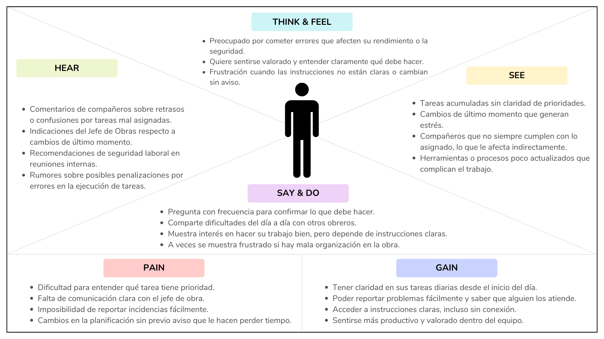

**Segmento 2:** Jefe de Obras.
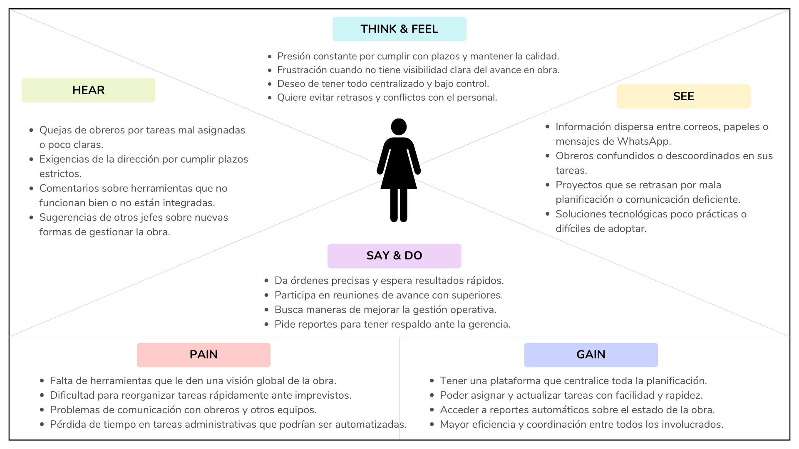

### **2.3.5. As-is Scenario Mapping**

## Segmento: Obrero
**Escenario:** Carlos inicia su jornada laboral en la obra y necesita saber exactamente qué tareas debe realizar y cómo priorizarlas.

| Fases     | Fase 1                                | Fase 2                                   | Fase 3                                         | Fase 4                                     |
|-----------|----------------------------------------|-------------------------------------------|------------------------------------------------|---------------------------------------------|
| **Doing** | Llega a la obra y espera instrucciones | Recibe indicaciones orales del jefe       | Realiza tareas con dudas sobre prioridades     | Intenta consultar a compañeros si surgen problemas |
| **Thinking** | “¿Qué tengo que hacer hoy?”            | “¿Esto que me dijeron es lo más urgente?” | “¿Estoy haciendo esto bien o me estoy equivocando?” | “¿A quién le digo si algo sale mal?”         |
| **Feeling** | Confundido por la falta de claridad   | Inseguro sobre lo que debe priorizar     | Frustrado si hay cambios inesperados           | Ansioso si hay errores que no puede resolver |

## Segmento: Jefe de Obras
**Escenario:** María debe planificar el trabajo de la semana y asegurarse de que todo el equipo tenga claridad sobre sus responsabilidades.

| Fases     | Fase 1                                        | Fase 2                                          | Fase 3                                                  | Fase 4                                           |
|-----------|-----------------------------------------------|--------------------------------------------------|-----------------------------------------------------------|--------------------------------------------------|
| **Doing** | Revisa el avance del proyecto en documentos sueltos | Intenta organizar tareas para cada obrero manualmente | Da instrucciones verbales o por mensajes al personal        | Monitorea el avance con visitas y correos        |
| **Thinking** | “¿Cómo hago para que todos estén bien coordinados?” | “¿Qué tareas puedo mover si hay retrasos?”         | “¿Me entendieron bien o habrá confusión?”                    | “¿Cómo justifico este retraso frente a la gerencia?” |
| **Feeling** | Presionada por el tiempo y la planificación  | Estresada por la dificultad de reasignar tareas  | Frustrada por errores o confusión en el equipo              | Agobiada por la carga de reportes manuales        |

## **2.4. Ubiquitous Language**

**Task Scheduling (Programación de Tareas)**  
- Asignación estructurada de actividades operativas a los trabajadores, considerando prioridades, tiempos de ejecución y recursos disponibles.

**Workflow Visibility (Visibilidad del Flujo de Trabajo)**  
- Capacidad para que todos los involucrados (obreros, jefes de obra, supervisores) vean en tiempo real el estado y progreso de las tareas asignadas.

**Operational Efficiency (Eficiencia Operativa)**  
- Optimización del uso de recursos humanos y materiales para cumplir con metas de producción en tiempo y forma.

**Work Orders (Órdenes de Trabajo)**  
- Instrucciones formales que detallan las tareas específicas a realizar, sus responsables, tiempos estimados y materiales requeridos.

**Incident Reporting (Reporte de Incidentes)**  
- Sistema para registrar eventos imprevistos o problemas durante la ejecución de tareas, con el fin de prevenir riesgos y mejorar procesos.

**Material Availability (Disponibilidad de Materiales)**  
- Control de inventario y confirmación de que los recursos necesarios para cada tarea están listos antes de comenzar su ejecución.

**Shift Coordination (Coordinación de Turnos)**  
- Organización de horarios y equipos de trabajo para garantizar la continuidad operativa sin sobrecargas ni interrupciones.

**Real-Time Communication (Comunicación en Tiempo Real)**  
- Intercambio instantáneo de información entre los diferentes niveles operativos para facilitar la toma de decisiones y resolver problemas rápidamente.

**Project Overview (Resumen del Proyecto)**  
- Visualización general del estado del proyecto, tareas completadas, pendientes, desviaciones y métricas clave.

**Performance Metrics (Métricas de Desempeño)**  
- Indicadores utilizados para medir la productividad y cumplimiento de tareas por parte del personal, como tiempo estimado vs. tiempo real o número de incidencias.

**User Roles (Roles de Usuario)**  
- Clasificación de los usuarios de la aplicación según su nivel de responsabilidad y acceso: obrero, jefe de obras, supervisor, etc.

**Safety Compliance (Cumplimiento de Seguridad)**  
- Aseguramiento de que todas las tareas se realizan bajo las normas establecidas para la seguridad laboral y operativa.

**Resource Allocation (Asignación de Recursos)**  
- Distribución eficiente de materiales, herramientas y personal según las necesidades del proyecto o tarea específica.

#  **Capítulo III: Requirements Specification**

## **3.1. To-Be Scenario Mapping**
## *3.2. User Stories*
| Epic/User Story ID | Título | Descripción | Criterios de Aceptación | Relacionado con (Epic ID) |
|-------|--------|------------|----------------------|-------------|
| EP01 | Gestión de Usuarios y Seguridad | Como sistema, necesito tener un control de usuarios seguro y personalizado para proteger la información y ofrecer una experiencia adaptada al perfil | N/A | N/A |
| US01 | Asignación de tareas |Como jefe de obra, deseo asignar tareas de manera eficiente a los obreros para asegurar que cada uno sepa lo que tiene que hacer | *Escenario 1:*   *Dado que* soy el jefe de obra y tengo tareas por asignar, *Cuando* asigno una tarea a un obrero, *Entonces* el obrero recibe una notificación con la tarea asignada, incluyendo fecha límite y prioridades.    *Escenario 2:*   *Dado que* soy el jefe de obra y tengo tareas por asignar, *Cuando* asigno una tarea que ya fue completada, *Entonces* el sistema me avisa que la tarea ya está cerrada y no permite asignarla nuevamente.    *Escenario 3:*   *Dado que* soy el jefe de obra y tengo tareas asignadas, *Cuando* intento asignar una tarea a un obrero que está sobrecargado, *Entonces* el sistema me muestra un aviso que indica que el obrero está sobrecargado y sugiere asignar la tarea a otro obrero disponible.    | EP01 |
| US02 | Notificación de tareas | Como obrero, quiero recibir notificaciones sobre las tareas que me asignan para saber qué hacer durante el día | *Escenario 1:*   *Dado que* soy obrero y tengo una tarea asignada, *Cuando* recibo una notificación, *Entonces* puedo ver la descripción de la tarea y la fecha límite.    *Escenario 2:*   *Dado que* soy obrero y tengo una tarea asignada, *Cuando* recibo una notificación de tarea con una fecha pasada, *Entonces* el sistema muestra un mensaje de alerta indicando que la fecha está vencida.    *Escenario 3:*    *Dado que* soy obrero y tengo tareas pendientes, *Cuando* recibo una notificación de una nueva tarea, *Entonces* el sistema muestra un resumen de las tareas pendientes y las urgencias.    |EP01|
| US03 | Prioridades claras de tareas | Como obrero, quiero ver las tareas prioritarias primero para saber qué debo hacer | *Escenario 1:*   *Dado que* soy obrero y tengo varias tareas asignadas, *Cuando* reviso la lista de tareas, *Entonces* las tareas más urgentes se muestran primero, con una indicación clara de su importancia.    *Escenario 2:*   *Dado que* soy obrero y tengo tareas asignadas, *Cuando* tengo tareas con la misma prioridad, *Entonces* se ordenan de manera aleatoria, pero con la misma importancia.    *Escenario 3:*   *Dado que* soy obrero y tengo tareas asignadas, *Cuando* las tareas no están ordenadas por prioridad, *Entonces* el sistema me muestra una advertencia para que pueda organizar las tareas por urgencia.    |EP01|
| US04 | Reporte de progreso de tareas | Como obrero, quiero actualizar el estado de las tareas a medida que las completo para mantener actualizado el progreso | *Escenario 1:*   *Dado que* soy obrero y he completado una tarea, *Cuando* actualizo el estado de la tarea a "completada", *Entonces* el sistema marca la tarea como "Completada" y se actualiza el progreso general.    *Escenario 2:*    *Dado que* soy obrero y he comenzado una tarea, *Cuando* actualizo el estado de la tarea a "en progreso", *Entonces* el sistema registra la tarea como "En progreso" y muestra el tiempo transcurrido.    *Escenario 3:*   *Dado que* soy obrero y no he comenzado una tarea, *Cuando* intento actualizar el estado de la tarea, *Entonces* el sistema muestra un mensaje de alerta indicando que la tarea aún no ha comenzado.    |EP01|
| US05 | Reporte de incidencias y problemas | Como obrero, quiero reportar incidencias rápidamente para que el jefe de obra pueda tomar medidas. | *Escenario 1:*   *Dado que* soy obrero y tengo un problema con una tarea, *Cuando* informo un problema a través de la plataforma, *Entonces* el jefe de obra recibe una notificación con los detalles del problema y puede tomar acción inmediata.    *Escenario 2:*   *Dado que* soy obrero y tengo un problema con una tarea, *Cuando* intento reportar una incidencia sin conexión, *Entonces* el sistema guarda el informe de forma local y lo envía cuando la conexión esté disponible.    *Escenario 3:*   *Dado que* soy obrero y tengo problemas con una herramienta, *Cuando* reporto la incidencia, *Entonces* el sistema permite adjuntar fotos o videos para ilustrar el problema.    |EP01|
| US06 | Comunicación clara entre obrero y jefe | Como jefe de obra, quiero recibir comunicaciones claras de los obreros para poder tomar decisiones rápidas sobre problemas en la obra | *Escenario 1:*   *Dado que* soy jefe de obra y un obrero me envía un mensaje, *Cuando* recibo el mensaje, *Entonces* el mensaje contiene una descripción clara y cualquier foto o información necesaria para comprender el problema.    *Escenario 2:*   *Dado que* soy jefe de obra y un obrero me envía un mensaje, *Cuando* el mensaje es urgente, *Entonces* el sistema me notifica con una alerta visual o sonora.    *Escenario 3:*   *Dado que* soy jefe de obra y un obrero me envía un mensaje, *Cuando* el mensaje es claro pero no urgente, *Entonces* el sistema lo clasifica como información de baja prioridad.    |EP01|
| US07 | Dashboard de tareas | Como jefe de obra, quiero ver un dashboard con el progreso de las tareas asignadas para asegurar que todo esté bajo control. | *Escenario 1:*   *Dado que* soy jefe de obra y quiero ver el progreso de las tareas, *Cuando* accedo al dashboard, *Entonces* puedo ver el estado actualizado de cada tarea, incluyendo si están completadas, en progreso o bloqueadas.    *Escenario 2:*   *Dado que* soy jefe de obra y quiero ver las tareas pendientes, *Cuando* accedo al dashboard, *Entonces* se muestran las tareas no completadas de forma destacada.    *Escenario 3:*   *Dado que* soy jefe de obra y quiero ver las tareas que requieren atención inmediata, *Cuando* accedo al dashboard, *Entonces* las tareas con incidencias o bloqueos se muestran con una alerta roja.    | EP01|
| EP02 | Supervisión y Monitoreo del Progreso | Como sistema, necesito herramientas para supervisar y monitorear el progreso de las tareas de la obra. | N/A | N/A |
| US08 | Monitoreo en tiempo real | Como jefe de obra, quiero monitorear el progreso de las tareas en tiempo real para poder hacer ajustes si es necesario | *Escenario 1:*   *Dado que* soy jefe de obra y tengo tareas asignadas, *Cuando* visualizo el estado de cada tarea, *Entonces* puedo ver el progreso en tiempo real y realizar ajustes si es necesario.    *Escenario 2:*   *Dado que* soy jefe de obra y tengo tareas asignadas, *Cuando* las tareas no están avanzando, *Entonces* el sistema me alerta sobre las tareas que no se están ejecutando según lo planeado.    *Escenario 3:*   *Dado que* soy jefe de obra y el progreso de las tareas no es el esperado, *Cuando* analizo el estado de las tareas en tiempo real, *Entonces* puedo reasignar recursos o ajustar el tiempo estimado para cumplir con el cronograma.    | EP02 |
| US09 | Generación de informes automáticos | Como jefe de obra, quiero generar informes automáticos de avance para compartir con la gerencia o el cliente | *Escenario 1:*   *Dado que* soy jefe de obra, *Cuando* solicito un informe de progreso, *Entonces* el sistema genera automáticamente un informe con las métricas clave y el estado de las tareas.    *Escenario 2:*   *Dado que* soy jefe de obra, *Cuando* el informe se genera, *Entonces* el sistema me permite personalizar el contenido del informe antes de enviarlo.    *Escenario 3:*   *Dado que* soy jefe de obra y necesito presentar el informe a la gerencia, *Cuando* el informe se genera, *Entonces* el sistema incluye gráficos y resúmenes de las tareas completadas, en progreso y bloqueadas.    | EP02 |
| US010 | Ajustes de planificación | Como jefe de obra, quiero ajustar la planificación cuando surjan imprevistos para evitar retrasos en el proyecto. | *Escenario 1:*   *Dado que* soy jefe de obra y una tarea necesita reprogramación, *Cuando* realizo los ajustes, *Entonces* el sistema actualiza el cronograma y notifica a los obreros afectados.    *Escenario 2:*    *Dado que* soy jefe de obra y necesito cambiar la fecha de una tarea, *Cuando* hago los ajustes, *Entonces* el sistema ajusta automáticamente las fechas relacionadas.    *Escenario 3:*   *Dado que* soy jefe de obra y una tarea debe cambiarse por un imprevisto, *Cuando* realizo el ajuste, *Entonces* el sistema recalcula el impacto en las demás tareas y muestra un resumen de los cambios.    | EP02 |
| US11 | Visualización de tareas con incidencias | Como jefe de obra, quiero visualizar las tareas que tienen incidencias o bloqueos para poder tomar medidas rápidas | *Escenario 1:*   *Dado que* soy jefe de obra y quiero ver el progreso de las tareas, *Cuando* accedo a la lista de tareas, *Entonces* las tareas con incidencias o bloqueos se muestran destacadas, indicando el tipo de problema.    *Escenario 2:*   *Dado que* soy jefe de obra y necesito conocer el estado de una tarea, *Cuando* la tarea presenta un bloqueo, *Entonces* el sistema me notifica con una alerta y el obrero responsable proporciona detalles del bloqueo.    *Escenario 3:*   *Dado que* soy jefe de obra y veo que una tarea tiene problemas, *Cuando* reviso los detalles de la tarea bloqueada, *Entonces* el sistema me sugiere posibles soluciones basadas en incidencias previas.    | EP02 |
| US12 | Asignación eficiente de recursos | Como jefe de obra, quiero asignar los recursos correctos a cada tarea para asegurar que las tareas se realicen sin problemas | *Escenario 1:*   *Dado que* soy jefe de obra y tengo recursos disponibles, *Cuando* asigno un recurso a una tarea, *Entonces* el sistema sugiere los recursos más adecuados basados en la tarea y su prioridad.    *Escenario 2:*   *Dado que* soy jefe de obra y los recursos están escasos, *Cuando* asigno los recursos, *Entonces* el sistema me alerta sobre la escasez y sugiere opciones alternativas de recursos disponibles.    *Escenario 3:*   *Dado que* soy jefe de obra y quiero asegurar la eficiencia en la asignación, *Cuando* asigno recursos a una tarea, *Entonces* el sistema muestra una estimación de tiempo para completar la tarea con los recursos asignados.    | EP02 |
| US13 | Reasignación de recursos en tiempo real |Como jefe de obra, quiero reasignar recursos rápidamente cuando haya cambios en el plan de trabajo | *Escenario 1:*   *Dado que* soy jefe de obra y necesito cambiar un recurso, *Cuando* reasigno el recurso a una nueva tarea, *Entonces* el sistema actualiza automáticamente el cronograma y notifica al obrero sobre el cambio.    *Escenario 2:*   *Dado que* soy jefe de obra y un recurso no está disponible, *Cuando* intento reasignar el recurso, *Entonces* el sistema me sugiere alternativas según la disponibilidad de los recursos restantes.    *Escenario 3:*   *Dado que* soy jefe de obra y necesito realizar ajustes rápidos en los recursos, *Cuando* reasigno un recurso, *Entonces* el sistema recalcula el impacto de la reasignación en el cronograma de tareas.    | EP02 |
| US14 | Visibilidad de recursos disponibles | Como obrero, quiero saber qué recursos están disponibles y cuáles no, para poder planificar mis tareas de manera más eficiente | *Escenario 1:*   *Dado que* soy obrero y tengo tareas asignadas, *Cuando* reviso la lista de recursos necesarios, <Entonces> puedo ver si los recursos están disponibles o si debo esperar que estén disponibles.    *Escenario 2:*   *Dado que* soy obrero y necesito materiales, *Cuando* los recursos no están disponibles, *Entonces* el sistema me muestra el tiempo estimado de disponibilidad.    *Escenario 3:*   *Dado que* soy obrero y tengo acceso a los recursos, *Cuando* reviso la lista de recursos, *Entonces* el sistema me muestra los recursos con un código de color, donde el verde indica disponibilidad inmediata y el rojo indica falta de recursos.    | EP02 |
| EP03 | Optimización del Trabajo en Equipo y Eficiencia | Como sistema, necesito optimizar el trabajo en equipo y la eficiencia de los recursos para mejorar la productividad en la obra | N/A | N/A |
| US15 | Monitoreo de eficiencia de los recursos | Como jefe de obra, quiero monitorear la eficiencia de los recursos para mejorar su utilización en futuras tareas | *Escenario 1:*   *Dado que* soy jefe de obra y quiero evaluar el uso de los recursos, *Cuando* reviso los informes de recursos, *Entonces* el sistema muestra un análisis detallado sobre el uso eficiente de cada recurso.    *Escenario 2:*   *Dado que* soy jefe de obra y quiero evaluar la eficiencia de un recurso, *Cuando* accedo a los informes de uso, *Entonces* puedo ver las recomendaciones para optimizar el uso de ese recurso en el futuro.    *Escenario 3:*   *Dado que* soy jefe de obra y quiero mejorar la eficiencia de los recursos, *Cuando* analizo la eficiencia de los recursos, *Entonces* el sistema me permite realizar ajustes basados en los patrones de uso.    | EP03 |
| US16 | Control de inventarios de materiales | Como jefe de obra, quiero controlar el inventario de materiales en tiempo real para asegurar que siempre haya suficiente material | *Escenario 1:*   *Dado que* soy jefe de obra y quiero verificar el inventario de materiales, *Cuando* accedo al inventario, *Entonces* puedo ver la cantidad disponible de cada material y el tiempo estimado para hacer un nuevo pedido.    *Escenario 2:*   *Dado que* soy jefe de obra y el inventario está bajo, *Cuando* reviso el estado del material, *Entonces* el sistema me alerta sobre la falta de materiales críticos y me sugiere realizar un pedido.    *Escenario 3:*   *Dado que* soy jefe de obra y quiero asegurar la disponibilidad de materiales, *Cuando* actualizo el inventario, *Entonces* el sistema muestra las variaciones del inventario en tiempo real con alertas de stock bajo.    | EP03 |
| US17 | Asignación automática de tareas | Como sistema, quiero asignar tareas automáticamente a los obreros basándome en su disponibilidad y habilidades para asegurar que las tareas sean asignadas de manera eficiente | *Escenario 1:*   *Dado que* soy el sistema y tengo una lista de tareas y obreros, *Cuando* una tarea está pendiente, *Entonces* el sistema asigna la tarea al obrero más adecuado en función de su habilidad y disponibilidad.    *Escenario 2:*   *Dado que* soy el sistema y hay tareas sin asignar, *Cuando* un obrero se vuelve disponible, *Entonces* el sistema asigna automáticamente las tareas pendientes a ese obrero.    *Escenario 3:*   *Dado que* soy el sistema y quiero optimizar la asignación de tareas, *Cuando* se asignan tareas automáticamente, *Entonces* el sistema garantiza que el obrero seleccionado tenga la capacitación necesaria para realizar la tarea.    | EP03 |
| US18 | Optimización de la comunicación interna | Como jefe de obra, quiero que todos los obreros estén al tanto de sus tareas a través de un sistema de comunicación eficiente para evitar malentendidos y mejorar la colaboración | *Escenario 1:*   *Dado que* soy jefe de obra, *Cuando* asigno tareas a los obreros, *Entonces* cada obrero recibe una notificación con los detalles de la tarea asignada, la fecha y cualquier comentario importante.    *Escenario 2:*   *Dado que* soy jefe de obra y quiero enviar un mensaje importante a todos los obreros, *Cuando* envío el mensaje, *Entonces* todos los obreros reciben la notificación de manera instantánea.    *Escenario 3:*   *Dado que* soy jefe de obra y quiero optimizar la comunicación, *Cuando* se asignan tareas, *Entonces* el sistema proporciona un canal de comunicación directa para que los obreros hagan preguntas o clarificaciones.    | EP03 |
| US19 | Evaluación del desempeño de los obreros | Como jefe de obra, quiero evaluar el desempeño de los obreros para mejorar la asignación de tareas y recursos en el futuro | *Escenario 1:*   *Dado que* soy jefe de obra y quiero evaluar el desempeño de un obrero, *Cuando* accedo al informe de desempeño, *Entonces* el sistema muestra los resultados de las tareas completadas y el tiempo invertido.    *Escenario 2:*   *Dado que* soy jefe de obra y quiero comparar el desempeño de varios obreros, *Cuando* accedo a los informes comparativos, *Entonces* el sistema genera una comparación de rendimiento para cada obrero en función de las tareas realizadas.    *Escenario 3:*   *Dado que* soy jefe de obra y quiero mejorar el desempeño, *Cuando* realizo la evaluación de un obrero, *Entonces* el sistema me sugiere tareas que podrían ayudar a mejorar sus habilidades o rendimiento.    | EP03 |
| US20 | Automatización de la asignación de trabajos | Como jefe de obra, quiero automatizar la asignación de trabajos para evitar errores y agilizar el proceso de asignación | *Escenario 1:*   *Dado que* soy jefe de obra y las tareas están listas para ser asignadas, *Cuando* el sistema evalúa la disponibilidad y habilidades de los obreros,  *Entonces* asigna las tareas de manera eficiente, minimizando errores humanos.    *Escenario 2:*   *Dado que* soy jefe de obra y el sistema ha asignado tareas automáticamente, *Cuando* una tarea es reasignada debido a una urgencia, <*Entonces* el sistema notifica automáticamente a los obreros involucrados y actualiza el cronograma.    *Escenario 3:*   *Dado que* soy jefe de obra y el sistema asigna tareas automáticamente, *Cuando* un obrero es sobrecargado de tareas, *Entonces* el sistema redistribuye las tareas automáticamente para asegurar una carga equilibrada de trabajo.    | EP03 |
| TS01 | POST HTTPS Usuarios | Como desarrollador, quiero registrar nuevos usuarios mediante una API para permitir el acceso al sistema | *Escenario 1:*    *Dado que* tengo acceso a la API de registro de usuarios, <Cuando> solicito registrar un usuario con datos válidos,  *Entonces* recibo confirmación de usuario creado con su identificador.    *Escenario 2:*    *Dado que* tengo acceso a la API de registro de usuarios,  *Cuando* solicito registrar un usuario con un email ya existente,  *Entonces* recibo un mensaje indicando que el email ya está registrado.    | N/A |
| TS02 | POST HTTPS Autenticación | Como desarrollador, quiero autenticar usuarios mediante una API para validar credenciales y permitir acceso seguro | *Escenario 1:*    *Dado que* tengo acceso a la API de autenticación,  *Cuandoenvío credenciales válidas de un usuario,  **Entonces* recibo confirmación de acceso autorizado.    *Escenario 2:*     *Dado que* tengo acceso a la API de autenticación,  *Cuando* envío credenciales incorrectas,  *Entonces* recibo un mensaje indicando error de autenticación.    | N/A |
| TS03 | GET HTTPS Planes | Como desarrollador, quiero obtener información sobre planes disponibles mediante una API para mostrar opciones de suscripción | *Escenario 1:*    *Dado que* tengo acceso a la API de planes,  *Cuando* solicito la lista de planes disponibles,  *Entonces*  recibo todos los planes con sus características y precios.    *Escenario 2:*     *Dado que* tengo acceso a la API de planes,  *Cuando* solicito los planes y hay un problema técnico,  *Entonces* recibo un mensaje indicando que el servicio no está disponible.    | N/A |
| TS04  | POST HTTPS Planes | Como desarrollador, quiero suscribir usuarios a planes mediante una API para gestionar acceso a funcionalidades | *Escenario 1:*    *Dado que* tengo acceso a la API de suscripciones,  *Cuando* solicito una suscripción con plan y pago válidos,  *Entonces* recibo confirmación de la suscripción activada.    *Escenario 2:*    *Dado que* tengo acceso a la API de suscripciones,  *Cuando* solicito una suscripción con método de pago rechazado,  **Entonces ** recibo un mensaje sobre el problema de pago.    | N/A |
| TS05 | POST HTTPS Proveedores | Como desarrollador, quiero registrar nuevos proveedores mediante una API para ampliar la red de suministro | *Escenario 1:*    *Dado que*  tengo acceso a la API de proveedores,  *Cuando* solicito registrar un proveedor con datos completos,  *Entonces* recibo confirmación del proveedor creado con su identificador.    *Escenario 2:*    *Dado que* tengo acceso a la API de proveedores,  *Cuando* solicito registrar un proveedor con datos incompletos,  *Entonces* recibo un mensaje con los campos requeridos faltantes.    | N/A |
| TS06  | GET HTTPS Proveedores | Como desarrollador, quiero consultar proveedores mediante una API para mostrar opciones disponibles | *Escenario 1:*     *Dado que* tengo acceso a la API de proveedores,  *Cuando* solicito la lista de proveedores con filtros,  *Entonces* recibo los proveedores que cumplen los criterios.    *Escenario 2:*    *Dado que* tengo acceso a la API de proveedores, <*Cuando* solicito proveedores con parámetros incorrectos,  *Entonces* recibo un mensaje indicando los parámetros inválidos.    | N/A |
| TS07 |  POST HTTPS Lotes | Como desarrollador, quiero registrar nuevos lotes de café mediante una API para mantener el inventario actualizado | *Escenario 1:*    *Dado que*  tengo acceso a la API de lotes,  *Cuando* solicito registrar un lote con datos completos,  *Entonces* recibo confirmación del lote creado con su código de trazabilidad.    *Escenario 2:*    *Dado que* tengo acceso a la API de lotes,  *Cuando* solicito registrar un lote con un proveedor inexistente,  *Entonces* recibo un mensaje indicando que el proveedor no existe.    | N/A |
| TS08  | PATCH HTTPS Lotes | Como desarrollador, quiero actualizar el estado de lotes mediante una API para reflejar cambios en el ciclo de vida | *Escenario 1:*    *Dado que* tengo acceso a la API de lotes,  *Cuando* solicito cambiar el estado de un lote a un valor válido,  *Entonces* recibo el lote con su estado actualizado.    *Escenario 2:*    *Dado que* tengo acceso a la API de lotes,  *Cuando* solicito un cambio de estado no permitido,  *Entonces* recibo un mensaje con los cambios de estado permitidos.    | N/A |

## *3.3. Impact Mapping*
## *3.4. Product Backlog*
| # Orden  | User Story Id | Título | Descripción | Story Points (1/2/3/5/8) | 
|-------|--------|------------|----------------------|-------------|
| 1 | US01 | Asignación de tareas | Como jefe de obra, deseo asignar tareas de manera eficiente a los obreros para asegurar que cada uno sepa lo que tiene que hacer | 5 |
| 2 | US02 | Notificación de tareas | Como obrero, quiero recibir notificaciones sobre las tareas que me asignan para saber qué hacer durante el día| 3 |
| 3 | US03 | Prioridades claras de tareas | Como obrero, quiero ver las tareas prioritarias primero para saber qué debo hacer | 3 |
| 4 | US04 | Reporte de progreso de tareas | Como obrero, quiero actualizar el estado de las tareas a medida que las completo para mantener actualizado el progreso | 5 |
| 5 | US05 | Reporte de incidencias y problemas | Como obrero, quiero reportar incidencias rápidamente para que el jefe de obra pueda tomar medidas  | 5 |
| 6 | US06 | Comunicación clara entre obrero y jefe | Como jefe de obra, quiero recibir comunicaciones claras de los obreros para poder tomar decisiones rápidas sobre problemas en la obra | 3 |
| 7 | US07 | Dashboard de tareas | Como jefe de obra, quiero ver un dashboard con el progreso de las tareas asignadas para asegurar que todo esté bajo control | 8 |
| 8 | US08 | Monitoreo en tiempo real | Como jefe de obra, quiero monitorear el progreso de las tareas en tiempo real para poder hacer ajustes si es necesario | 8 |
| 9 | US09 | Generación de informes automáticos | Como jefe de obra, quiero generar informes automáticos de avance para compartir con la gerencia o el cliente | 8 |
| 10 | US010 | Ajustes de planificación | Como jefe de obra, quiero ajustar la planificación cuando surjan imprevistos para evitar retrasos en el proyecto | 5 |
| 11 | US011 | Visualización de tareas con incidencias | Como jefe de obra, quiero visualizar las tareas que tienen incidencias o bloqueos para poder tomar medidas rápidas | 5 |
| 12 | US012 | Asignación eficiente de recursos | Como jefe de obra, quiero asignar los recursos correctos a cada tarea para asegurar que las tareas se realicen sin problemas | 3 |
| 13 | US013 | Reasignación de recursos en tiempo real | Como jefe de obra, quiero reasignar recursos rápidamente cuando haya cambios en el plan de trabajo | 3 |
| 14 | US014 | Visibilidad de recursos disponibles | Como obrero, quiero saber qué recursos están disponibles y cuáles no, para poder planificar mis tareas de manera más eficiente | 5 |
| 15 | US015 | Monitoreo de eficiencia de los recursos  | Como jefe de obra, quiero monitorear la eficiencia de los recursos para mejorar su utilización en futuras tareas | 5 |
| 16 | US016 | Control de inventarios de materiales | Como jefe de obra, quiero controlar el inventario de materiales en tiempo real para asegurar que siempre haya suficiente material |3 |
| 17 | US017 | Asignación automática de tareas | Como sistema, quiero asignar tareas automáticamente a los obreros basándome en su disponibilidad y habilidades | 8 |
| 18 | US018 | Optimización de la comunicación interna  | Como jefe de obra, quiero que todos los obreros estén al tanto de sus tareas a través de un sistema de comunicación eficiente | 3 |
| 19 | US019 | Evaluación del desempeño de los obreros | Como jefe de obra, quiero evaluar el desempeño de los obreros para mejorar la asignación de tareas y recursos en el futuro | 5 |
| 20 | US020 | Automatización de la asignación de trabajos | Como jefe de obra, quiero automatizar la asignación de trabajos para evitar errores y agilizar el proceso de asignación | 3 |

# **Capítulo IV: Product Design**

## **4.1. Style Guidelines**
### **4.1.1. General Style Guidelines**
En esta sección, estableceremos las directrices generales de estilo para nuestra aplicación web. La aplicación busca proyectar una imagen de innovación tecnológica, sostenibilidad y simplicidad con un diseño relacionado con nuestros segmentos objetivos.

### Tipografia
La tipografía seleccionada es el estilo "Roboto". El tamaño de la fuente varía según su propósito.
Para los títulos, se emplean tamaños más grandes para captar la atención del usuario, en este caso, se ha utilizado un tamaño de 48 y para los subtítulos tamaños como 40, 32 y 24.
Los párrafos tienen un tamaño de fuente menor para acompañar los subtítulos. El tamaño seleccionado es 16.

### Colores
Header/Footer:004E7C
Fondo:FFFFFF
Botones:C41E3A
Texto:1A1A1A
Resaltado:FFD700

### Espaciado
Es importante emplear un espaciado que facilite una lectura clara y cómoda, evitando que la vista se fatigue. 
Para conseguirlo, se recomienda utilizar un interlineado moderado, es decir, ni excesivamente reducido ni demasiado amplio, tanto entre los distintos elementos del texto (párrafos y líneas) como dentro de ellos.

### Comunicación Visual
Queremos que la plataforma se sienta moderna y sencilla para el usuario para que no les cueste el uso.

- **Formalidad:** Accesible pero profesional, con un lenguaje claro que invite al uso sencillo de la plataforma.
- **Estilo de Mensajes:** Directo y claro, evitando jerga técnica innecesaria.
- **Entusiasmo:** Transmitiendo optimismo sobre el impacto positivo en la gestion de las tareas.

### **4.1.2. Web Style Guidelines**
En esta sección se mostrará con ilustraciones las decisiones tomadas en los estándares visuales y de interacción de nuestra pagina web.

## **4.2. Information Architecture**
### **4.2.1. Organization Systems**
- **Jerarquía Visual:**
 Para mantener la belleza de nuestra plataforma interactiva y flexible, hemos optado por darle prioridad a la interfaz en función de su relevancia para simplificar la interacción con el usuario.

- **Alineación:**
  En nuestra plataforma, nuestras imágenes y botones se encuentran alineados de manera ordenada. Permitiendo así agrupar varios objetos de diversos tipos con la misma información.

- **Organización Secuencial:**
  Además, los métodos de almacenamiento sobre los registros que el usuario final emplea siguen una organización secuencial, esto con el objetivo de mejorar la simplicidad y la rapidez con la que se almacenan y acceden a ellos. En el caso de nuestro proyecto, organizaremos la visualización de la lista de **scooters** y **bicicletas**.

- **Esquemas de categorización de contenido de nuestra web:**
  Para la organización visual, utilizaremos el sistema jerárquico, lo que nos permitirá resaltar los componentes a los que deseamos que el usuario preste mayor atención.

### **4.2.2. Labeling Systems**
 Para establecer un sistema de etiquetado eficiente en nuestra aplicación usamos un lenguaje formal para que nuestros nuevos
 usuarios puedan identificar facilmente estas etiquetas.

---

### Etiquetas en la Landing Page:

| **Etiqueta** | **Descripción**                                                                                |
| ------------ | ---------------------------------------------------------------------------------------------- |
| Inicio       | Apartado donde se muestra una introducción de lo que trata. |
| Funcionalidades  | Apartado donde se muestran muestran los beneficios de la aplicación.     |
| Suscríbete   | Apartado donde puedes suscribirte para tener beneficios adicionales.                                 |
| Contáctanos  | Apartado donde el usuario puede comunicarse con nosotros ante cualquier duda.                 |
| Comenzar     | Apartado que te redirige a la aplicación web.                                                  |

### **4.2.3. SEO Tags and Meta Tags**
Se utilizaron los siguientes tags en el desarrollo:

- SEO tag Header: Las principales etiquetas de encabezado del Html de nuestra página contendrán la información más importante de nuestra aplicación, conteniendo el nombre, descripción y funcionalidades de nuestra aplicación web

- SEO tah Url: Emplearemos una Url sencilla para la búsqueda.

- Meta title: Título de la página, ayuda a identificar el nombre de la misma y encontrarla en los navegadores.

- Meta tag Author: Es el autor de la página, en este caso utilizamos el nombre del startup.

- Meta tag Description: Es una descripción de la página, ayuda a tener una idea general de que trata la página.

- Meta tag Keywords: Son palabras clave que ayudaran a los usuarios a poder encontrar la página aunque no busquen exactamente el nombre de la misma.
### **4.2.4. Searching Systems**
Implementaremos métodos para mejorar la experiencia de búsqueda de nuestros usuarios. Utilizaremos un sistema de búsqueda por texto que permita a los usuarios encontrar la tarea respectiva de una manera rápida. Los sistemas de búsqueda que se usarán son:

- Barra de búsqueda: Estos servirán para ayudar al usuario a encontrar la tarea que busca.
- Inicio estático: Es el complemento perfecto por si el usuario se siente confundido dentro del flujo de la aplicación. De este modo, el usuario puede regresar de nuevo al punto de inicio cuando lo necesite.

### **4.2.5. Navigation Systems**
Esta parte de la aplicación se enfoca en guiar a los usuarios de manera efectiva mientras navegan por la plataforma y utilizan sus numerosas funcionalidades.
Como sistema de navegación, para el landing page, nos encargamos de realizar una página vertical con poco texto donde el usuario pueda navegar sin saltarse a otra página y confundirse por la inmensidad de información. Nuestro landing page cuenta con secciones como:

- Funcionalidades: El usuario podrá visualizar las funcionalidad y beneficios que tienen por usar nuestra aplicación.
- Contactanos: Donde los usuarios a través de un formulario podrán ponerse en contacto con nosotros.
- Experiencia: El usuario podrá visualizar los comentarios y opiniones de otros usuarios.
- Start: El usuario en la sección de "Prueba Gratis Ahora" podrá ir a la web, donde lo mandará primero a iniciar sesión o registrarse para probar la web.

Como sistema de navegación, para la web, optamos emplear una barra de menú horizontal en la parte superior que guiará al usuario por las diferentes secciones con títulos y botones estáticos, esto facilitará al usuario a tener todas las herramientas a la mano y así disfrutar de una mejor navegación. Nuestra barra de menú contará con las siguientes secciones:

- About us: El usuario podrá visualizar a qué se dedica nuestra Startup, su misión y visión, y el equipo detrás de esta aplicación web.
- Subscription: Aquí podrá obtener toda la información de los beneficios de la suscripción que la aplicación le ofrece.
- Contact us: Donde los usuarios a través de un formulario podrán ponerse en contacto con nosotros.
- Barra de búsqueda: Se usa la barra denavegación para poder realizar la búsqueda que quiera el usuario.

## **4.3. Landing Page UI Design**

En el siguiente punto se abordará el diseño de la interfaz de usuario de la página de aterrizaje, la primera impresión visual y funcional que los usuarios tienen al interactuar con un sitio web. Este diseño tiene como objetivo captar la atención, guiar a los usuarios hacia una acción específica y ofrecer una experiencia intuitiva. Se enfoca en la disposición efectiva de los elementos visuales, como los llamados a la acción (CTAs), contenido relevante y diseño responsivo, asegurando que la página sea atractiva, fácil de navegar y optimizada para convertir visitantes en usuarios o cliente

### **4.3.1. Landing Page Wireframe**

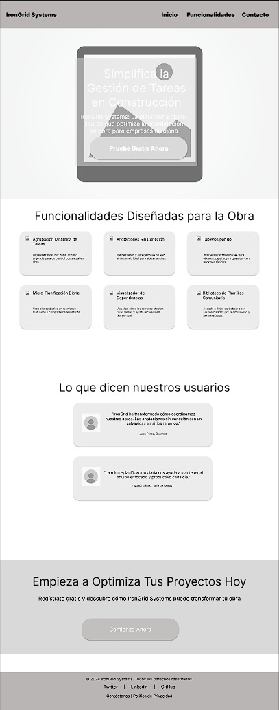

### **4.3.2. Landing Page Mock-up**

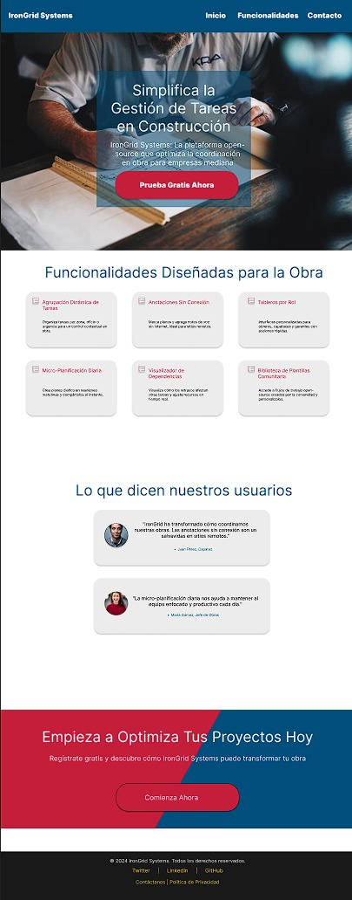

## **4.5. Web Applications Prototyping**

## **4.6. Domain-Driven Software Architecture**
### **4.6.1. Software Architecture Context Diagram**
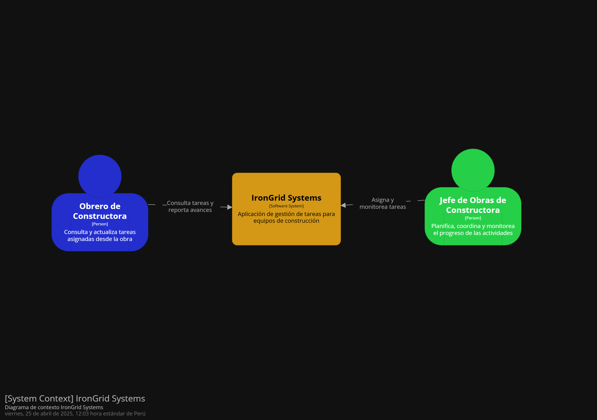

### **4.6.2. Software Architecture Container Diagrams**
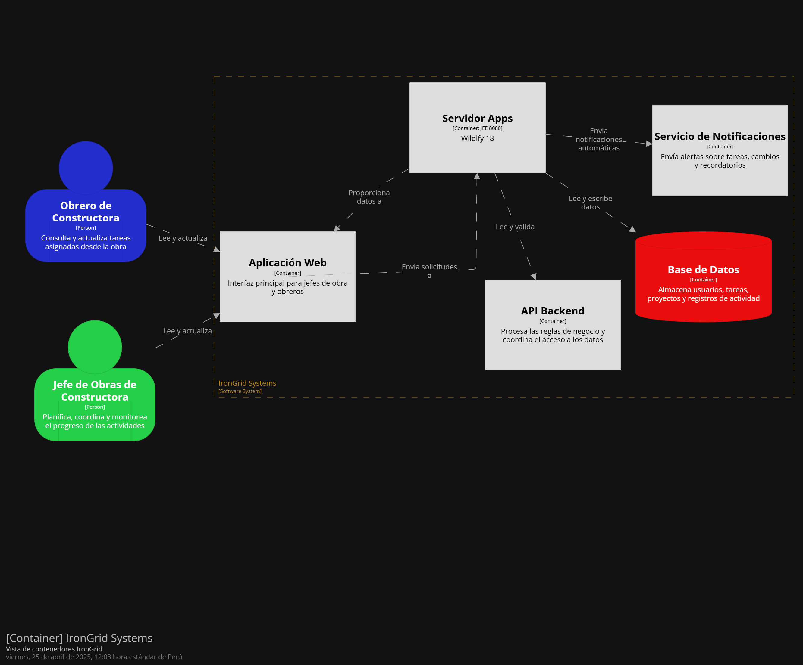

### **4.6.3. Software Architecture Components Diagrams**
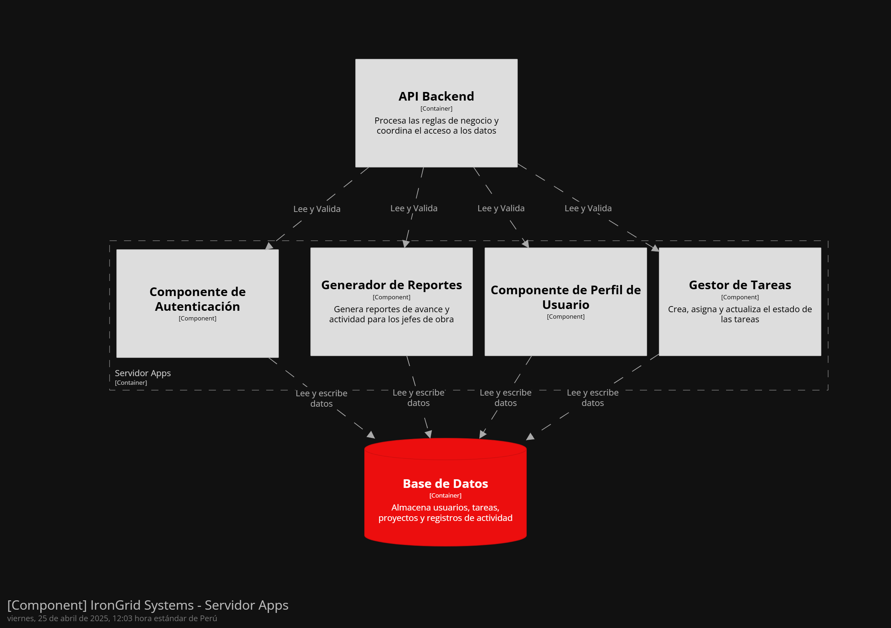

## **4.7. Software Object-Oriented Design**
### **4.7.1. Class Diagrams**
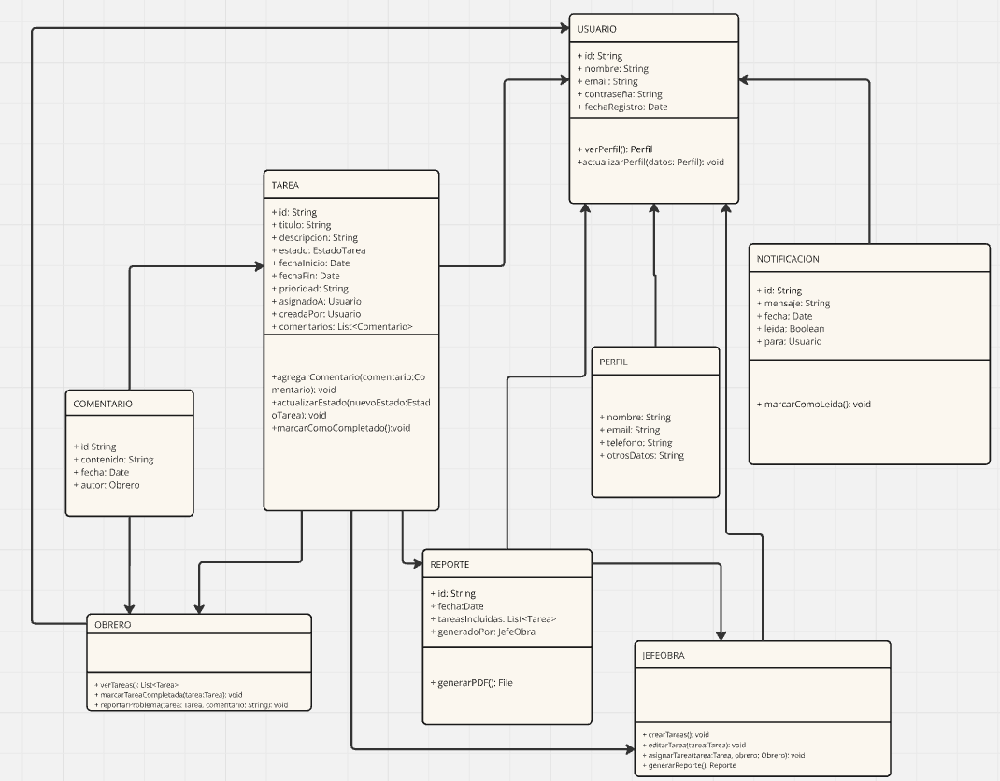

### **4.7.2. Class Dictionary**
Usuario: Entidad abstracta que representa a cualquier usuario del sistema, incluyendo sus datos básicos y acceso al perfil. Es extendida por Obrero y Jefe de Obra.

Obrero: Subtipo de Usuario que representa a los trabajadores de campo. Puede visualizar tareas asignadas, marcar tareas como completadas y reportar problemas mediante comentarios.

JefeObra: Subtipo de Usuario que representa a los supervisores o responsables de obra. Tiene permisos para crear, editar y asignar tareas, así como generar reportes de avance.

Perfil: Clase que encapsula la información personal editable de un usuario, como nombre, email, teléfono, foto y otros datos relevantes.

Tarea: Entidad que representa una actividad planificada dentro de la obra. Contiene información como título, descripción, fechas, prioridad, estado actual, comentarios y los usuarios relacionados (creador y asignado).

Comentario: Entidad que permite a los Obreros dejar observaciones o reportes de problemas relacionados a una tarea. Incluye fecha, contenido y autor del comentario.

Reporte: Entidad generada por un Jefe de Obra que agrupa tareas en una fecha determinada, con el objetivo de evaluar el avance del proyecto.

Notificacion: Entidad que representa un mensaje informativo dentro del sistema, enviado a un usuario en una fecha determinada, y que puede marcarse como leída.

CambioEstado: Entidad que registra cada modificación en el estado de una tarea, incluyendo la fecha, el nuevo estado y el usuario que realizó el cambio. Útil para auditoría y trazabilidad.

## **4.8. Database Design**
### **4.8.1. Database Diagram**
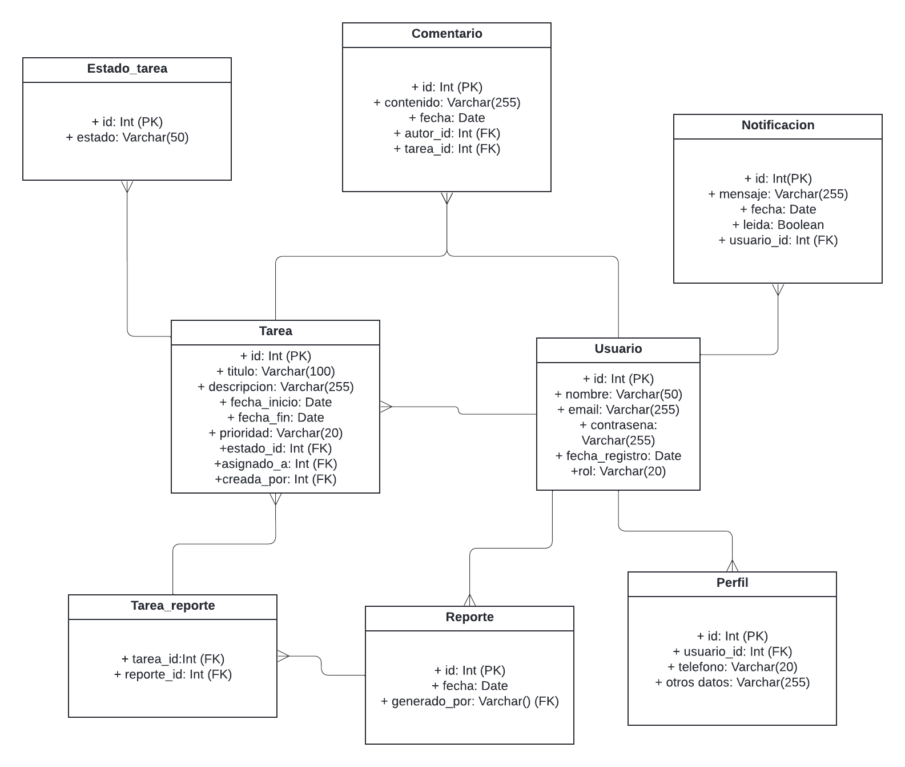

# **Capítulo V: Product Implementation, Validation & Deployment**
En esta sección detallaremos las herramientas, referencias y configuraciones que fueron utilizadas a lo largo de nuestro proyecto.
## **5.1. Software Configuration Management**
A continuación, detallaremos las herramientas usadas a lo largo de nuestro proyecto, las cuales nos han ayudado a mantener una base sólida y ordenada.
### **5.1.1. Software Development Environment Configuration**
Figma: https://www.figma.com/ 
Herramienta visual usada para el diseño del prototipo de la pagina web. Además de ser usada para las creaciones de los wireframes y mockups del desktop and mobile application del proyecto realizado. 
 
LucidChart: https://lucid.app/ 
Herramienta online para crear diagramas como flujogramas, diagramas UML, mapas mentales y arquitecturas de software. 
 
Trello: https://trello.com/ 
Herramienta de gestión de tareas basada en tableros, listas y tarjetas. Nos permitió organizar el proyecto de forma visual y colaborativa, ideal para hacer seguimiento de actividades, asignar responsabilidades y ver el progreso del trabajo. 
 
UxPressia: https://uxpressia.com/ 
Herramienta online para crear mapas de experiencia del usuario, customer journey maps y personas. Ayuda a visualizar y mejorar la experiencia del cliente de forma colaborativa y centrada en el usuario. 
 
Landing Page: 
Para el desarrollo de la Landing Page se utilizó HTML, CSS Y JS. 
 
Software Deployment: 
Netlify: https://www.netlify.com/ 
Plataforma en la cual hospedamos la Landing Page. 
 
### **5.1.2. Source Code Management**
Se utilizó GitHub como plataforma y sistema de control de versiones.  
Organization: https://github.com/TF-Open-Source 
Landing Page Repository: https://github.com/TF-Open-Source/IronGrid---Landing-Page 
Report Repository: https://github.com/TF-Open-Source/informe 
 
### **5.1.3. Source Code Style Guide & Conventions**
Con el propósito de mantener la consistencia, buenas prácticas y legibilidad durante el desarrollo del proyecto, hemos adoptado las siguientes guías de estilo y convenciones para el desarrollo del código: 
Para el Coding Convention: 
•	Hemos nombrado todos los elementos del código (funciones, variables, clases, archivos, etc) en inglés. 
•	Los nombres deben ser claros, descriptivos y seguir las nomenclaturas estándar de cada lenguaje según corresponda. 
 
Para el Code Style guide: 
HTML & CSS 
•	Se sigue la guía de estilo Google HTML/CSS Style Guide. 
•	Se aplica la regla de atributos en minúscula y cierre adecuado de etiquetas. 
•	Se debe utilizar letras minúsculas para elementos HTML, atributos, propiedades, valores y selectores de CSS. 
 
JavaScript & TypeScript 
•	Se sigue la guía de Google JavaScript Style Guide y la Google TypeScript Style Guide.
Java 
•	Se utiliza la Google Java Style Guide.
Angular 
•	Se sigue la Angular coding style guide. Además, se incluye la separación por módulos, uso de servicios y buenas prácticas en componentes. 
 
### **5.1.4. Software Deployment Configuration**
A continuación, demostraremos el proceso de despliegue de nuestra Landing Page mediante el servicio automatizado de Netlify:
1.	Debemos tener nuestra landing page en un repositorio en GitHub:
   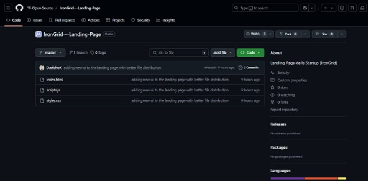 
2.  Debemos iniciar sesión o crear una cuenta en caso no tengamos una en netlify:
   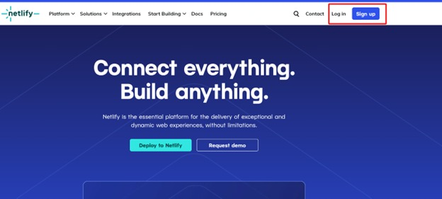 
3.  Una vez dentro, en el panel general, debemos seleccionar la opción “sites” y luego “Add new site” e importaremos desde un proyecto ya existente:
   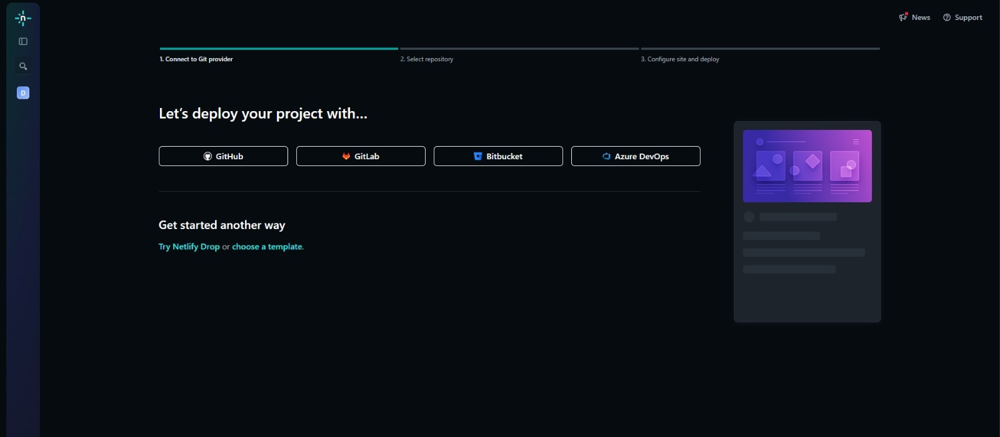 
4.  Daremos los permisos necesarios para que acceda a nuestro repositorio y seleccionaremos nuestra landing page a desplegar:
   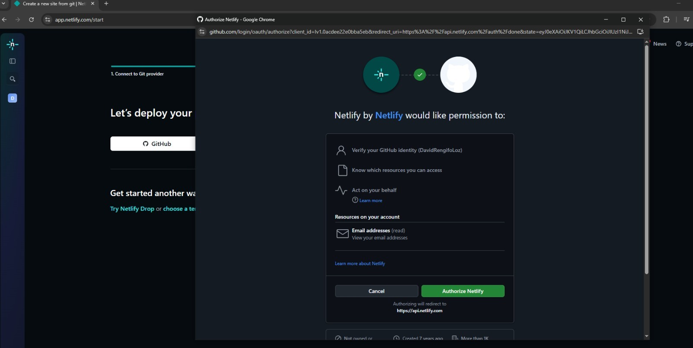 
   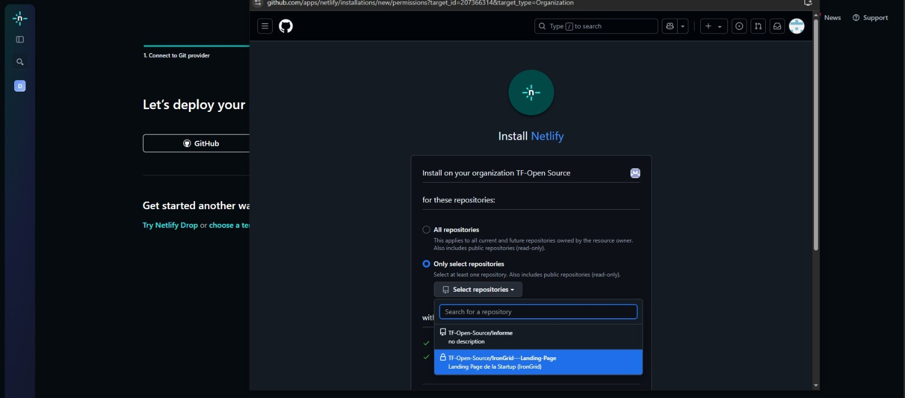 
5.  Por último, damos las últimas configuraciones necesarias para el despliegue:
   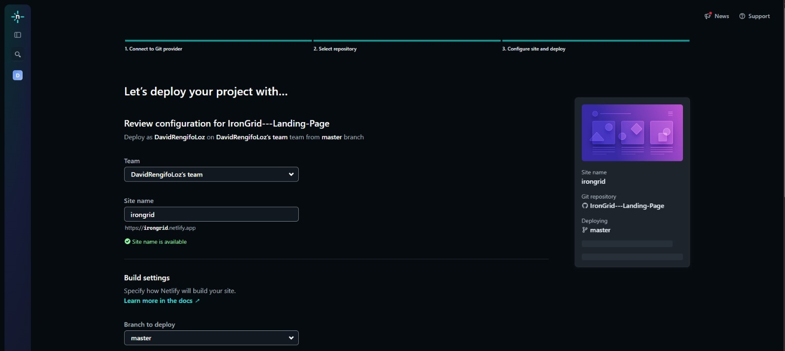 
   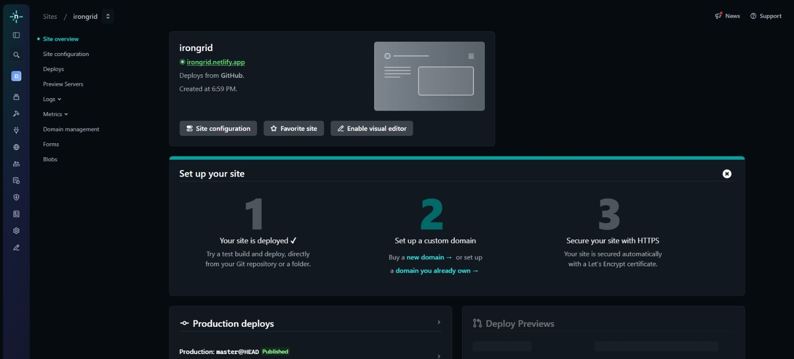 
## **5.2. Landing Page, Services & Applications Implementation**
## **5.2.1. Sprint 1**
### **5.2.1.1. Sprint Planning 1** 
A continuación, presentamos el Sprint 1 de nuestro proyecto, el cual está enfocado en la planificación y desarrollo de la landing page. 
| Sprint #                                                                                                   | Sprint 1 |
|-----------------------------------------------------------------------------------------------------------------------|-------------------|
| Sprint Planning Background                   |         |
|Date                     | 2025-04-12        |  
| Time | 06:00 PM         | 
| Location      | Virtual - Discord        |                                 |
| Prepared By                              | David Rengifo         | 
|Attendees                                 | Travezaño Patiño, Eduard Gedeon / Rengifo Lozano, David / Pachas Chavez. Alejandro Alberto / Estrada Cajamune. Abraham Andrés / Cueva Elera, Erick Armando / Chavez Viera, Joseph Manuel                  |
|Sprint 0 Review Summary                   |Debido a que es nuestro primer Sprint, no existe un Review Summary del Sprint anterior                        |
|Sprint 0 Retrospective Summary|Debido a que es nuestro primer Sprint, no existe un Retrospective Summary           |
|Sprint Goal & User Stories|               |
|Sprint 1 Goal              |Our focus is on desarrollar y desplegar la landing page del proyecto We believe it delivers interés e información to personas que estén interesadas en un software de gestión de obras para empresas medianas This will be confirmed when las personas interesadas se contacten con nosotros para mayor información acerca de nuestro software |
|Sprint 1 Velocity|10 |
|Sum of Story Points|8 |
### **5.2.1.2. Aspect Leaders and Collaborators** 
| Team member                                                                                                   | GitHub Username | Desarrollo de la landing page|Despliegue de la Landing Page |Redacción y verificación del informe |
|-----------------------------------------------------------------------------------------------------------------------|-------------------|-|-|-|
|Chavez Viera, Joseph Manuel                   | U202314019-MrOsoPanda        |C |C |C |
|Cueva Elera, Erick Armando                     | ECueva1809        |C|C|L|
|Estrada Cajamune. Abraham Andrés                        |   Abraham0310           | C | C | L | 
|Pachas Chavez. Alejandro Alberto                        |   Alejandropch           | C |  C| C |
|Rengifo Lozano, David                        |   DavidRengifoLoz           | L | L | C |
|Travezaño Patiño, Eduard Gedeon                        |   EduardTrave           | C |C  | L |

### **5.2.1.3. Sprint Backlog 1** 
| Sprint #                                                                                                   | Sprint 1 | | | | | | |
|-----------------------------------------------------------------------------------------------------------------------|-------------------|-|-|-|-|-|-|
| User Story                   | Work-Item/Task        | | | | | | |
|Id                     | Title        |Id|Title|Description|Estimation|Assigned To|Status|
|    US01                    | Barra de navegación de la Landing Page   |W01          | Landing Page NavBar |Desarrollar la barra de navegación de la landing page  | 0.5 | Cueva Elera, Erick Armando/Rengifo Lozano, David | Done | 
|     US02                   | Sección de product information             | W02 |Landing page producto information  |Desarrollar la sección de la información del producto en la landing page  | 0.5 | Estrada Cajamune Abraham Andres/Chavez Viera Joseph Manuel | Done |
|      US03                  | Sección de testimonios             | W03 |Landing page testimonios  | Desarrollar la sección de testimonios en la landing page | 0.5 | Travezaño Patiño, Eduard Gedeon/Pachas Chavez, Alejandro Alberto | Done |
|      US04                  | Sección de descarga de software             | W04 | Landing page software download |Desarrollar la sección en donde se permita descargar el software en la landing page  | Rengifo Lozano, David | 0.5 |Done  |

### **5.2.1.4. Development Evidence for Sprint Review** 
En este Sprint, hemos desarrollado y desplegado la Landing Page del proyecto. A continuación, presentamos nuestro cuadro de commits realizados durante el Sprint: 
|Repository|Branch|Commid Id|Commit Message| Commit Message Body|Commited on (Date)|
|-           |  -    |    -    |     -         |       -             |   -               |
|TF-Open-Source/IronGrid---Landing-Page           |master      |53e685c15d1637b374d965e1674336c870a62e31 |Landing page| |22/04/2025|
|TF-Open-Source/IronGrid---Landing-Page           |master      |3cb1a0a6af13f80bb87dea80892a2a75d38f8e07        | Adding new ui to the landing page             |                    |  24/04/2025              |
| TF-Open-Source/IronGrid---Landing-Page          |master      |e4abda8c69a57e5eee2df78a982178dcdc7e49c6        |Adding new ui to the landing page with better file distribution              |                    | 24/04/2025               |
### **5.2.1.5. Execution Evidence for Sprint Review** 
En este Sprint, desarrollamos la Landing Page, la cual se encuentra en el siguiente URL: https://irongrid.netlify.app/  
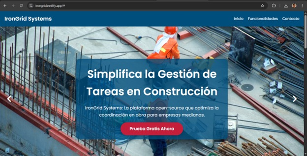 
### **5.2.1.6. Services Documentation Evidence for Sprint Review** 
Al tratarse de una Landing Page, no se requiere de una documentación de servicios. 
### **5.2.1.7. Software Deployment Evidence for Sprint Review** 
En este sprint, hemos realizado el despliegue total de la Landing Page.
Para el despliegue hemos usado “Netlify”, una plataforma de alojamiento web y automatización de despliegue, que permite publicar sitios y aplicaciones web. 
 
### **5.2.1.8. Team Collaboration Insights during Sprint**
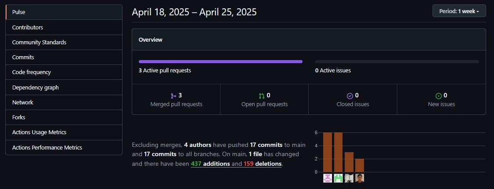 

## **5.3. Validation Interviews**
### **5.3.1. Diseño de Entrevistas**
### **5.3.2. Registro de Entrevistas**
### **5.3.3. Evaluaciones según heurísticas**

## **5.4. Video About-the-Product**

# **Conclusiones**
# **Conclusiones y recomendaciones**

# **Video About-the-Team**

# **Bibliografía**

Del Rosario Rivero Pérez, M., & De Educación, P. M. (2013). *El valor educativo de los cuidados infantiles: para la atención de los niños y niñas de 0 a 3 años. Guía de orientación*. En Ministerio de Educación eBooks. [http://disde.minedu.gob.pe/handle/20.500.12799/5177](http://disde.minedu.gob.pe/handle/20.500.12799/5177)

Marin, H. M. (2022, 23 junio). “Uno de los grandes desafíos es reducir la brecha entre los niños que atendemos y los que aún nos necesitan”. *El Comercio Perú*. [https://elcomercio.pe/lima/sucesos/aldeas-infantiles-uno-de-los-grandes-desafios-es-reducir-la-brecha-entre-los-ninos-que-atendemos-y-los-que-aun-nos-necesitan-dereje-wordofa-presidente-internacional-de-aldeas-infantiles-sos-peru-noticia/](https://elcomercio.pe/lima/sucesos/aldeas-infantiles-uno-de-los-grandes-desafios-es-reducir-la-brecha-entre-los-ninos-que-atendemos-y-los-que-aun-nos-necesitan-dereje-wordofa-presidente-internacional-de-aldeas-infantiles-sos-peru-noticia/)

Condiciones de vida en el Perú: impacto económico de los servicios de cuidado infantil. (2021). En Instituto Nacional de Estadística E Informática (INEI). Recuperado 22 de agosto de 2024, de https://www.inei.gob.pe

# **Anexos**

