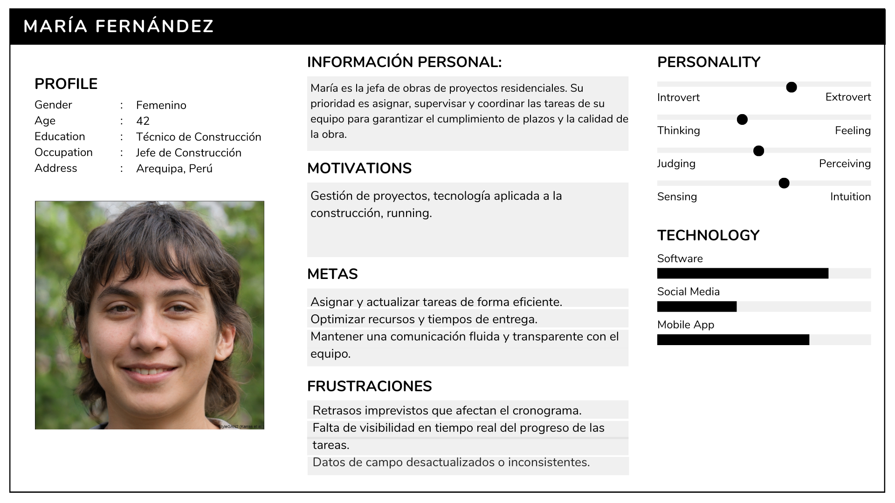
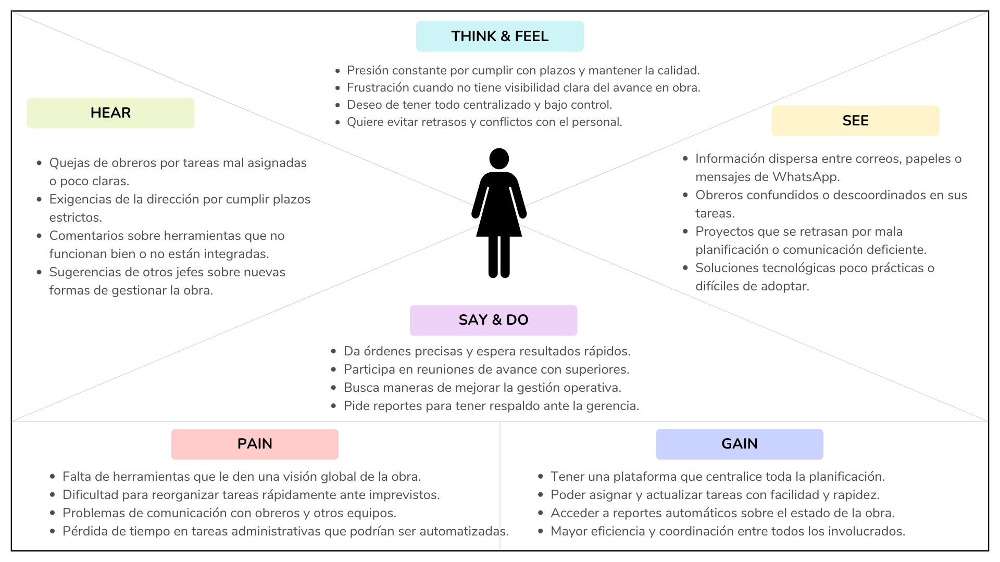

<h3 align="center"> Universidad Peruana de Ciencias Aplicadas </h3>

<h3 align="center"> Ingeniería de Software </h3>
<h3 align="center"> Ciclo 2024 - 2 </h3>

 

  

 
<h3 align="center"> Desarrollo de Aplicaiones Open Source - SW56 </h3>
<h3 align="center"> Profesor del Curso:  </h3>
<h3 align="center"> "INFORME DE TRABAJO FINAL"</h3>
<h3 align="center"> EMPRESA DE INICIO: nombre </h3>

<h3 align="center"> PRODUCTO: "NOMBRE"</h3>

| Miembro                                |    Código     |
| :------------------------------------- | :-----------: |
| Pachas Chavez, Alejandro Alberto     | U201917598    |
| Rengifo Lozano, David   | U202221022   |
| Chavez Viera Joseph Manuel          | U202314019    |
| Estrada Cajamune Abraham Andres    |  U202112164   |
| Travezaño Patiño, Eduard Gedeon    | U20211A789  |
|           |      |

<h3 align="center"> 2024 </h3>

 

# **Registro de Versiones del Informe**

<table BORDER>
    <tr>
        <td>VERSION</td>
        <td>FECHA</td>
        <td> AUTOR </td>
        <td>DESCRIPCION DE MODIFICACION</td>
    </tr>
    <tr>
        <td>01</td>
        <td>23/08/2024</td>
        <td> L </td>
        <td>Formato del documento</td>
    </tr>
    <tr>
        <td></td>
        <td></td>
        <td></td>
        <td></td>
    </tr>
    <tr>
        <td></td>
        <td></td>
        <td></td>
        <td></td>
    </tr>
</table>

# **Project Report Collaboration Insights**

URL del repositorio de la Organizacion: <https://github.com/AgroRoute>

# **Contenido**
### Tabla de contenidos
- [**Registro de Versiones del Informe**](#registro-de-versiones-del-informe)
- [**Project Report Collaboration Insights**](#project-report-collaboration-insights)
- [**Contenido**](#contenido)
    - [Tabla de contenidos](#tabla-de-contenidos)
- [**Student Outcome**](#student-outcome)
- [ **Capítulo I: Introducción** ](#-capítulo-i-introducción-)
  - [**1.1. Startup Profile**](#11-startup-profile)
    - [**1.1.1. Descripción de la Startup**](#111-descripción-de-la-startup)
    - [**1.1.2. Perfiles de integrantes del equipo**](#112-perfiles-de-integrantes-del-equipo)
  - [**1.2. Solution Profile**](#12-solution-profile)
    - [**1.2.1 Antecedentes y problemática**](#121-antecedentes-y-problemática)
    - [What (¿Qué?)](#what-qué)
    - [Who (¿Quién?)](#who-quién)
    - [Where (¿Dónde?)](#where-dónde)
    - [When (¿Cuándo?)](#when-cuándo)
    - [Why (¿Por qué?)](#why-por-qué)
    - [How (¿Cómo?)](#how-cómo)
    - [How much (¿Cuánto?)](#how-much-cuánto)
    - [**1.2.2 Lean UX Process**](#122-lean-ux-process)
    - [**1.2.2.1. Lean UX Problem Statements**](#1221-lean-ux-problem-statements)
    - [**1.2.2.2. Lean UX Assumptions**](#1222-lean-ux-assumptions)
    - [**1.2.2.3. Lean UX Hypothesis Statements**](#1223-lean-ux-hypothesis-statements)
    - [**1.2.2.4. Lean UX Canvas**](#1224-lean-ux-canvas)
  - [**1.3. Segmentos objetivo**](#13-segmentos-objetivo)
- [ **Capítulo II: Requirements Elicitation \& Analysis**](#-capítulo-ii-requirements-elicitation--analysis)
  - [**2.1. Competidores**](#21-competidores)
    - [**2.1.1. Análisis competitivo**](#211-análisis-competitivo)
    - [**2.1.2. Estrategias y tácticas frente a competidores**](#212-estrategias-y-tácticas-frente-a-competidores)
  - [**2.2. Entrevistas**](#22-entrevistas)
    - [**2.2.1. Diseño de entrevistas**](#221-diseño-de-entrevistas)
    - [**2.2.2. Registro de entrevistas**](#222-registro-de-entrevistas)
    - [**2.2.3. Análisis de entrevistas**](#223-análisis-de-entrevistas)
  - [**2.3. Needfinding**](#23-needfinding)
    - [**2.3.1. User Personas**](#231-user-personas)
    - [**2.3.2. User Task Matrix**](#232-user-task-matrix)
    - [**2.3.3. User Journey Mapping**](#233-user-journey-mapping)
    - [**2.3.4. Empathy Mapping**](#234-empathy-mapping)
    - [**2.3.5. As-is Scenario Mapping**](#235-as-is-scenario-mapping)
  - [**2.4. Ubiquitous Language**](#24-ubiquitous-language)
- [ **Capítulo III: Requirements Specification**](#-capítulo-iii-requirements-specification)
  - [**3.1. To-Be Scenario Mapping**](#31-to-be-scenario-mapping)
  - [**3.2. User Stories**](#32-user-stories)
  - [**3.3. Impact Mapping**](#33-impact-mapping)
  - [**3.4. Product Backlog**](#34-product-backlog)
- [**Capítulo IV: Product Design**](#capítulo-iv-product-design)
  - [**4.1. Style Guidelines**](#41-style-guidelines)
    - [**4.1.1. General Style Guidelines**](#411-general-style-guidelines)
    - [**4.1.2. Web Style Guidelines**](#412-web-style-guidelines)
  - [**4.2. Information Architecture**](#42-information-architecture)
    - [**4.2.1. Organization Systems**](#421-organization-systems)
    - [**4.2.2. Labeling Systems**](#422-labeling-systems)
    - [**4.2.3. SEO Tags and Meta Tags**](#423-seo-tags-and-meta-tags)
    - [**4.2.4. Searching Systems**](#424-searching-systems)
    - [**4.2.5. Navigation Systems**](#425-navigation-systems)
  - [**4.3. Landing Page UI Design**](#43-landing-page-ui-design)
    - [**4.3.1. Landing Page Wireframe**](#431-landing-page-wireframe)
    - [**4.3.2. Landing Page Mock-up**](#432-landing-page-mock-up)
  - [**4.4. Web Applications UX/UI Design**](#44-web-applications-uxui-design)
    - [**4.4.1. Web Applications Wireframes**](#441-web-applications-wireframes)
    - [**4.4.2. Web Applications Wireflow Diagrams**](#442-web-applications-wireflow-diagrams)
    - [**4.4.3. Web Applications Mock-ups**](#443-web-applications-mock-ups)
    - [**4.4.4. Web Applications User Flow Diagrams**](#444-web-applications-user-flow-diagrams)
  - [**4.5. Web Applications Prototyping**](#45-web-applications-prototyping)
  - [**4.6. Domain-Driven Software Architecture**](#46-domain-driven-software-architecture)
    - [**4.6.1. Software Architecture Context Diagram**](#461-software-architecture-context-diagram)
    - [**4.6.2. Software Architecture Container Diagrams**](#462-software-architecture-container-diagrams)
    - [**4.6.3. Software Architecture Components Diagrams**](#463-software-architecture-components-diagrams)
  - [**4.7. Software Object-Oriented Design**](#47-software-object-oriented-design)
    - [**4.7.1. Class Diagrams**](#471-class-diagrams)
    - [**4.7.2. Class Dictionary**](#472-class-dictionary)
  - [**4.8. Database Design**](#48-database-design)
    - [**4.8.1. Database Diagram**](#481-database-diagram)
- [**Capítulo V: Product Implementation, Validation \& Deployment**](#capítulo-v-product-implementation-validation--deployment)
  - [**5.1. Software Configuration Management**](#51-software-configuration-management)
    - [**5.1.1. Software Development Environment Configuration**](#511-software-development-environment-configuration)
    - [**5.1.2. Source Code Management**](#512-source-code-management)
    - [**5.1.3. Source Code Style Guide \& Conventions**](#513-source-code-style-guide--conventions)
    - [**5.1.4. Software Deployment Configuration**](#514-software-deployment-configuration)
  - [**5.2. Landing Page, Services \& Applications Implementation**](#52-landing-page-services--applications-implementation)
    - [**5.2.1. Sprint 1**](#521-sprint-1)
        - [**5.2.1.1. Sprint Planning 1**](#5211-sprint-planning-1)
        - [**5.2.1.2. Sprint Backlog 1**](#5212-sprint-backlog-1)
        - [**5.2.1.3. Development Evidence for Sprint Review**](#5213-development-evidence-for-sprint-review)
        - [**5.2.1.4. Testing Suite Evidence for Sprint Review**](#5214-testing-suite-evidence-for-sprint-review)
        - [**5.2.1.5. Execution Evidence for Sprint Review**](#5215-execution-evidence-for-sprint-review)
        - [**5.2.1.6. Services Documentation Evidence for Sprint Review**](#5216-services-documentation-evidence-for-sprint-review)
        - [**5.2.1.7. Software Deployment Evidence for Sprint Review**](#5217-software-deployment-evidence-for-sprint-review)
        - [**5.2.1.8. Team Collaboration Insights during Sprint**](#5218-team-collaboration-insights-during-sprint)
    - [**5.2.2. Sprint 2**](#522-sprint-2)
        - [**5.2.2.1. Sprint Planning 2**](#5221-sprint-planning-2)
        - [**5.2.2.2. Sprint Backlog 2**](#5222-sprint-backlog-2)
        - [**5.2.2.3. Development Evidence for Sprint Review**](#5223-development-evidence-for-sprint-review)
        - [**5.2.2.4. Testing Suite Evidence for Sprint Review**](#5224-testing-suite-evidence-for-sprint-review)
        - [**5.2.2.5. Execution Evidence for Sprint Review**](#5225-execution-evidence-for-sprint-review)
        - [**5.2.2.6. Services Documentation Evidence for Sprint Review**](#5226-services-documentation-evidence-for-sprint-review)
        - [**5.2.2.7. Software Deployment Evidence for Sprint Review**](#5227-software-deployment-evidence-for-sprint-review)
        - [**5.2.2.8. Team Collaboration Insights during Sprint**](#5228-team-collaboration-insights-during-sprint)
    - [**5.2.3. Sprint 3**](#523-sprint-3)
        - [**5.2.3.1. Sprint Planning 3**](#5231-sprint-planning-3)
        - [**5.2.3.2. Sprint Backlog 3**](#5232-sprint-backlog-3)
        - [**5.2.3.3. Development Evidence for Sprint Review**](#5233-development-evidence-for-sprint-review)
        - [**5.2.3.4. Testing Suite Evidence for Sprint Review**](#5234-testing-suite-evidence-for-sprint-review)
        - [**5.2.3.5. Execution Evidence for Sprint Review**](#5235-execution-evidence-for-sprint-review)
        - [**5.2.3.6. Services Documentation Evidence for Sprint Review**](#5236-services-documentation-evidence-for-sprint-review)
        - [**5.2.3.7. Software Deployment Evidence for Sprint Review**](#5237-software-deployment-evidence-for-sprint-review)
        - [**5.2.3.8. Team Collaboration Insights during Sprint**](#5238-team-collaboration-insights-during-sprint)
    - [**5.2.4. Sprint 4**](#524-sprint-4)
        - [**5.2.4.1. Sprint Planning 4**](#5241-sprint-planning-4)
        - [**5.2.4.2. Sprint Backlog 4**](#5242-sprint-backlog-4)
        - [**5.2.4.3. Development Evidence for Sprint Review**](#5243-development-evidence-for-sprint-review)
        - [**5.2.4.4. Testing Suite Evidence for Sprint Review**](#5244-testing-suite-evidence-for-sprint-review)
        - [**5.2.4.5. Execution Evidence for Sprint Review**](#5245-execution-evidence-for-sprint-review)
        - [**5.2.4.6. Services Documentation Evidence for Sprint Review**](#5246-services-documentation-evidence-for-sprint-review)
        - [**5.2.4.7. Software Deployment Evidence for Sprint Review**](#5247-software-deployment-evidence-for-sprint-review)
        - [**5.2.4.8. Team Collaboration Insights during Sprint**](#5248-team-collaboration-insights-during-sprint)
  - [**5.3. Validation Interviews**](#53-validation-interviews)
    - [**5.3.1. Diseño de Entrevistas**](#531-diseño-de-entrevistas)
    - [**5.3.2. Registro de Entrevistas**](#532-registro-de-entrevistas)
    - [**5.3.3. Evaluaciones según heurísticas**](#533-evaluaciones-según-heurísticas)
  - [**5.4. Video About-the-Product**](#54-video-about-the-product)
- [**Conclusiones**](#conclusiones)
- [**Conclusiones y recomendaciones**](#conclusiones-y-recomendaciones)
- [**Video About-the-Team**](#video-about-the-team)
- [**Bibliografía**](#bibliografía)
- [**Anexos**](#anexos)

# **Student Outcome**

#  **Capítulo I: Introducción** 
## **1.1. Startup Profile**
### **1.1.1. Descripción de la Startup**

<strong>Nombre de la Startup:</strong> IronGrid Systems

IronGrid Systems es una startup enfocada en transformar la gestión de tareas en equipos de construcción mediante herramientas tecnológicas innovadoras           y adaptables. Su propósito es brindar soluciones eficientes que optimicen la planificación, coordinación y monitoreo de actividades en proyectos de                construcción.

<h3>Solución y Propuesta Tecnológica</h3>

Nuestra plataforma digital permite a las empresas constructoras administrar tareas de manera organizada y mejorar la comunicación entre sus equipos. Para ello, IronGrid Systems integra:

<ul>
        <li><strong>Gestión Visual:</strong> Tableros interactivos para visualizar el progreso de las tareas.</li>
        <li><strong>Accesibilidad Multidispositivo:</strong> Interfaz intuitiva optimizada para uso tanto en oficina como en campo.</li>
        <li><strong>Integración con Servicios Externos:</strong> Conexiones con herramientas de logística y geolocalización.</li>
        <li><strong>Seguridad y Transparencia:</strong> Tecnologías open-source que garantizan estabilidad y escalabilidad.</li>
</ul>
<h3>Misión y Visión</h3>
<h4>Misión</h4>

Facilitar la gestión de tareas en equipos de construcción mediante soluciones tecnológicas innovadoras que impulsen la productividad y la colaboración.

<h4>Visión</h4>

Liderar la transformación digital en el sector de la construcción, ofreciendo herramientas confiables que optimicen los procesos y potencien la eficiencia operativa.

### **1.1.2. Perfiles de integrantes del equipo**
## **1.2. Solution Profile**

### **1.2.1 Antecedentes y problemática**
### What (¿Qué?)
 

### Who (¿Quién?)
 
### Where (¿Dónde?)
 

### When (¿Cuándo?)
 

### Why (¿Por qué?)
 
### How (¿Cómo?)
 
### How much (¿Cuánto?)
 
### **1.2.2 Lean UX Process**
### 1.2.2.1. Lean UX Problem Statements

#### Problem Statement para Padres:

 
#### Problem Statement para Cuidadores:

 

### 1.2.2.2. Lean UX Assumptions

- **Asumimos que**  
  - **Sabremos que esto es cierto cuando**  

- **Asumimos que** 
  - **Sabremos que esto es cierto cuando** 

- **Asumimos que** 
  - **Sabremos que esto es cierto cuando** 

- **Asumimos que**  
  - **Sabremos que esto es cierto cuando**  

### **1.2.2.3. Lean UX Hypothesis Statements**

<ol>
<li> <b>Creemos que</b>   <b>Sabremos que</b>   <b>cuando</b> 
</li>
<li> <b>Creemos que</b>   <b>Sabremos que</b>    <b>cuando</b>   
</li>
<li> <b>Creemos que</b>  <b>Sabremos que</b>  <b>cuando</b>   
</ol>

### **1.2.2.4. Lean UX Canvas**

##### 1.2.2.1. Lean UX Canvas
<table>
  <tr>
    <th valign="top">
      
<b>1. Business Problem</b>

      
 .

    </th>
    <th valign="top">
      
<b>2. Business Outcomes</b>

      
-   .

      
-  .

      
-  .

      
-  .

    </th>
    <th rowspan="2" valign="top">
      
<b>5. Solutions</b>

      
- .

      
-  .

    </th>
  </tr>
  <tr>
    <td valign="top">
      
<b>3. Users</b>

      
-  .

      
-  .

      
-  .

    </td>
    <td valign="top">
      
<b>4. User Benefits</b>

      
-  .

      
-  

    </td>
  </tr>
  <tr>
    <td valign="top">
      
<b>6. Hypothesis</b>

      
- .

      
-  

    </td>
    <td valign="top">
      
<b>7. What’s the most important thing we need to learn first?</b>

      
 .

    </td>
    <td valign="top">
      
<b>8. What’s the least amount of work we need to do to learn the next most important thing?</b>

      
.

    </td>
  </tr>
</table>

## **1.3. Segmentos objetivo**

 

**1.**

 

- #### Caracteristicas Demograficas
 

**2. **

 

- #### Caracteristicas Demograficas
 
#  **Capítulo II: Requirements Elicitation & Analysis**
## **2.1. Competidores**
### **2.1.1. Análisis competitivo**

<TABLE BORDER style="width:100%">
    <tr>
        <th colspan="6"> Competitive Analysis Landscape</th>
    </tr>
    <tr>
        <td rowspan="2">
            ¿Por qué llevar a cabo este análisis?
        </td>
        <td colspan="5"> 
        Escriba en el recuadro la pregunta que busca responder o el objetivo de este análisis. 
        </td>
    </tr>
    <tr>
        <td colspan="5"></td>
    </tr>
    <tr>
        <td colspan="2">
            (En la cabecera colocar por cada competidor nombre y logo)
        </td>
        <td> IronGrid </td>
        <td> Fieldwire </td>
        <td> Buildertrend </td>
        <td> Procore </td>
    </tr>
    <tr>
        <th rowspan="2"> Perfil</th>
        <td>Overview</td>
        <td>Plataforma que transforma la gestión de tareas en la construcción, diseñada para trabajadores de campo en empresas medianas.</td>
        <td>Una plataforma centrada en la gestión de tareas en obra, planos, inspecciones y comunicación para equipos de construcción</td>
        <td>Un software de gestión de la construcción integral,
            diseñado especificamente para constructores residenciales, remodeladores y contratistas.</td>
        <td>Una plataforma de gestión de la construcción robusta y ampliamente utilizada en proyectos comerciales, industriales y residenciales</td>
    </tr>
    <tr>
        <td>
            Ventaja competitiva ¿Qué valor ofrece a los clientes?
        </td>
        <td>Solución ligera, open-source, centrada en campo, accesible y colaborativa.</td>
        <td>Interfaz intuitiva, productividad en obra, gestión de planos.</td>
        <td>Gestión integral para residencial, portal para clientes.</td>
        <td>Plataforma completa, escalable para proyectos grandes.</td>
    </tr>
    <tr>
        <th rowspan="2"> Perfil de Marketing</th>
        <td>Mercado objetivo</td>
        <td>Constructoras medianas, mercados emergentes.</td>
        <td>Constructoras pequeñas a grandes, proyectos comerciales.</td>
        <td>Constructores residenciales, contratistas pequeños a medianos.</td>
        <td>Constructoras grandes, proyectos comerciales/industriales.</td>
    </tr>
    <tr>
        <td>
            Estrategias de marketing
        </td>
        <td>SEO, contenido educativo, freemium, comunidad open-source.</td>
        <td>Anuncios LinkedIn, ferias, pruebas gratuitas, blogs técnicos.</td>
        <td>Redes sociales, ferias locales, referidos, contenido para PYMES.</td>
        <td>Marketing empresarial, eventos globales, casos de éxito.</td>
    </tr>
    <tr>
        <th rowspan="3"> Perfil de Producto</th>
        <td>Productos & Servicios</td>
        <td>Gestión de tareas, plantillas comunitarias, soporte, integraciones básicas.</td>
        <td>Tareas, planos, inspecciones, soporte, integraciones.</td>
        <td>Proyectos, CRM, finanzas, soporte, integraciones financieras.</td>
        <td>Proyectos, finanzas, seguridad, soporte, integraciones avanzadas.</td>
    </tr>
    <tr>
        <td>
            Precios & Costos
        </td>
        <td>Freemium, $10-$30/usuario/mes.</td>
        <td>$29-$59/usuario/mes.</td>
        <td>$99-$699/mes (por proyectos).</td>
        <td>$50-$100/usuario/mes (cotización).</td>
    </tr>
    <tr>
        <td>
            Canales de distribución (Web y/o Móvil)
        </td>
        <td></td>
        <td>Web, móvil, ventas directas, partners.</td>
        <td>Web, móvil, ventas directas, asociaciones.</td>
        <td>Web, móvil, ventas empresariales, partners ERP.</td>
    </tr>
    <tr>
        <th rowspan="5"> Análisis SWOT</th>
        <td colspan="5">
        Realice esto para su startup y sus competidores. Sus fortalezas deberían apoyar sus oportunidades y contribuir a lo que ustedes definen como su posible ventaja competitiva. 
        </td>
    </tr>
    <tr>
        <td>
            Fortalezas
        </td>
        <td>funcionalidades centradas en campo (anotaciones offline, micro-planificación), comunidad colaborativa, bajo costo.</td>
        <td>Interfaz intuitiva, enfoque en campo, adopción rápida, soporte para múltiples idiomas.</td>
        <td>Enfoque en residencial, portal para clientes, integración financiera, facilidad de uso.</td>
        <td>Plataforma completa, escalabilidad, integraciones avanzadas, reconocimiento de marca.</td>
    </tr>
    <tr>
        <td>
            Debilidades
        </td>
        <td>Falta de reconocimiento de marca, recursos limitados como startup, curva de adopción para usuarios no técnicos.</td>
        <td>Menor profundidad en gestión financiera o de recursos comparado con Procore, dependencia de suscripciones.</td>
        <td>Menor aplicabilidad en proyectos comerciales grandes, funciones de campo menos robustas que Fieldwire.</td>
        <td>Complejidad y alto costo, menos accesible para empresas pequeñas, curva de aprendizaje.</td>
    </tr>
    <tr>
        <td>
           Oportunidades
        </td>
        <td>Creciente digitalización en mercados emergentes, demanda de soluciones económicas, potencial para expandir la biblioteca comunitaria.</td>
        <td>Expansión a mercados emergentes, integración con nuevas tecnologías (BIM).</td>
        <td>Crecimiento en mercados residenciales emergentes, adopción de BIM para diseño.</td>
        <td>Expansión a nuevos mercados, integración con tecnologías emergentes (IA, IoT).</td>
    </tr>
    <tr>
        <td>
            Amenazas
        </td>
        <td>Competencia de plataformas establecidas (Procore, Fieldwire), riesgo de baja adopción si no se comunica bien el valor open-source.</td>
        <td>Competencia de Procore y soluciones económicas como IronGrid, presión por bajar precios.</td>
        <td>Competencia de Procore en proyectos grandes, soluciones económicas como IronGrid.</td>
        <td>Competencia de soluciones económicas como IronGrid, presión por reducir costos.</td>
    </tr>
</TABLE>

### **2.1.2. Estrategias y tácticas frente a competidores**

## **2.2. Entrevistas**
### **2.2.1. Diseño de entrevistas**
### **2.2.2. Registro de entrevistas**
### **2.2.3. Análisis de entrevistas**

## **2.3. Needfinding**
### **2.3.1. User Personas**
**Segmento 1:** Obrero de Constructura.  

**Segmento 2:** Jefe de Obras de Constructura.

### **2.3.2. User Task Matrix**

# User Task Matrix

## Usuario: Carlos Morales (Obrero)

| Tareas                                    | Objetivos de las tareas                                          | Soporte de BuildPlanning                                                                                         |
| :----------------------------------------: | :---------------------------------------------------------------: | :---------------------------------------------------------------------------------------------------------------- |
| Ver lista de tareas asignadas             | Conocer qué debe hacer cada día y en qué orden                   | Panel principal con notificaciones push y lista ordenada por fecha y prioridad                                    |
| Actualizar estado de una tarea            | Informar progreso real (iniciado, en curso, completado)           | Botones rápidos para cambiar estado y sincronización automática, incluso en modo offline                         |
| Reportar incidencia o bloqueo en obra      | Alertar al jefe sobre problemas que impidan continuar             | Formulario integrado para adjuntar fotos, comentarios y ubicación GPS; notifica inmediatamente al Jefe de Obras  |
| Consultar detalles e instrucciones         | Asegurar que entiende bien los requisitos y normas de seguridad   | Fichas de tarea con descripciones, planos y manuales descargables para consulta sin conexión                     |
| Comunicar dudas o comentarios              | Mantener flujo de comunicación y resolver dudas al instante       | Chat interno o sección de comentarios en cada tarea con alertas al Jefe de Obras                                 |

## Usuario: María Fernández (Jefe de Obras)

| Tareas                                      | Objetivos de las tareas                                        | Soporte de BuildPlanning                                                                                              |
| :------------------------------------------: | :-------------------------------------------------------------: | :--------------------------------------------------------------------------------------------------------------------- |
| Asignar tareas a obreros                    | Distribuir trabajo de forma equilibrada y según habilidades    | Interfaz drag‑&‑drop para crear y asignar tareas a cada obrero con fechas, prioridad y recursos                       |
| Reprogramar o actualizar plazos             | Ajustar cronograma ante imprevistos y evitar retrasos          | Calendario interactivo que permite mover tareas y notifica automáticamente a los obreros afectados                     |
| Eliminar o archivar tareas completadas      | Mantener el tablero limpio y enfocarse en lo pendiente         | Opción de “archivar” con registro de métricas (tiempo invertido, fotos finales) y filtros para ver histórico            |
| Monitorear progreso en tiempo real          | Tener visibilidad constante del avance y detectar cuellos       | Dashboard con indicadores de estado (completado/en curso/incidencias) y mapa de obra con ubicación de cada tarea       |
| Generar reportes de avance y cumplimiento   | Facilitar la toma de decisiones y reportar a la gerencia       | Generador automático de informes PDF o Excel con gráficas de progreso, tiempos de ejecución y alertas de desviación    |

### **2.3.3. User Journey Mapping**
**Registration (Registro):**  
Why would they trust us?  
- Investigan sobre BuildPlanning antes de registrarse.  
- Leen recomendaciones de otros obreros o jefes de obra que ya la usan.  
- Verifican que la plataforma cuenta con respaldo de su empresa o supervisor directo.

**Onboarding and first use (Incorporación y primer uso):**  
How can they feel successful?  
- Completan un registro simple con acceso a través de su correo o ID de empleado.  
- La interfaz inicial les da una visión clara de sus tareas o capacidades de gestión.  
- Reciben una guía rápida sobre cómo asignar tareas (jefe) o revisar asignaciones (obrero).

**Daily Use (Uso diario):**  
How can they maintain engagement?  
- Visualizan el progreso de tareas en tiempo real.  
- Reciben recordatorios o actualizaciones de tareas importantes.  
- Pueden reportar incidencias o pedir ayuda desde la app fácilmente.

**Problem Solving (Resolución de problemas):**  
How can we help them overcome frustration?  
- El soporte técnico está disponible con solo un clic dentro de la plataforma.  
- La documentación o FAQ es accesible e incluye ejemplos claros.  
- Pueden comunicarse con su equipo directamente desde la aplicación.

**Sharing (Compartir o recomendar):**  
Why would they invite others?  
- Jefes de obra ven mejoras en la organización y delegación.  
- Obreros sienten que su trabajo es más claro y estructurado.  
- La plataforma ofrece beneficios como reducción de errores o ahorro de tiempo que desean compartir con otros equipos o empresas.

### **2.3.4. Empathy Mapping**
**Segmento 1:** Obrero.  

**Segmento 2:** Jefe de Obras.

### **2.3.5. As-is Scenario Mapping**

## Segmento: Obrero
**Escenario:** Carlos inicia su jornada laboral en la obra y necesita saber exactamente qué tareas debe realizar y cómo priorizarlas.

| Fases     | Fase 1                                | Fase 2                                   | Fase 3                                         | Fase 4                                     |
|-----------|----------------------------------------|-------------------------------------------|------------------------------------------------|---------------------------------------------|
| **Doing** | Llega a la obra y espera instrucciones | Recibe indicaciones orales del jefe       | Realiza tareas con dudas sobre prioridades     | Intenta consultar a compañeros si surgen problemas |
| **Thinking** | “¿Qué tengo que hacer hoy?”            | “¿Esto que me dijeron es lo más urgente?” | “¿Estoy haciendo esto bien o me estoy equivocando?” | “¿A quién le digo si algo sale mal?”         |
| **Feeling** | Confundido por la falta de claridad   | Inseguro sobre lo que debe priorizar     | Frustrado si hay cambios inesperados           | Ansioso si hay errores que no puede resolver |

## Segmento: Jefe de Obras
**Escenario:** María debe planificar el trabajo de la semana y asegurarse de que todo el equipo tenga claridad sobre sus responsabilidades.

| Fases     | Fase 1                                        | Fase 2                                          | Fase 3                                                  | Fase 4                                           |
|-----------|-----------------------------------------------|--------------------------------------------------|-----------------------------------------------------------|--------------------------------------------------|
| **Doing** | Revisa el avance del proyecto en documentos sueltos | Intenta organizar tareas para cada obrero manualmente | Da instrucciones verbales o por mensajes al personal        | Monitorea el avance con visitas y correos        |
| **Thinking** | “¿Cómo hago para que todos estén bien coordinados?” | “¿Qué tareas puedo mover si hay retrasos?”         | “¿Me entendieron bien o habrá confusión?”                    | “¿Cómo justifico este retraso frente a la gerencia?” |
| **Feeling** | Presionada por el tiempo y la planificación  | Estresada por la dificultad de reasignar tareas  | Frustrada por errores o confusión en el equipo              | Agobiada por la carga de reportes manuales        |

## **2.4. Ubiquitous Language**

**Task Scheduling (Programación de Tareas)**  
- Asignación estructurada de actividades operativas a los trabajadores, considerando prioridades, tiempos de ejecución y recursos disponibles.

**Workflow Visibility (Visibilidad del Flujo de Trabajo)**  
- Capacidad para que todos los involucrados (obreros, jefes de obra, supervisores) vean en tiempo real el estado y progreso de las tareas asignadas.

**Operational Efficiency (Eficiencia Operativa)**  
- Optimización del uso de recursos humanos y materiales para cumplir con metas de producción en tiempo y forma.

**Work Orders (Órdenes de Trabajo)**  
- Instrucciones formales que detallan las tareas específicas a realizar, sus responsables, tiempos estimados y materiales requeridos.

**Incident Reporting (Reporte de Incidentes)**  
- Sistema para registrar eventos imprevistos o problemas durante la ejecución de tareas, con el fin de prevenir riesgos y mejorar procesos.

**Material Availability (Disponibilidad de Materiales)**  
- Control de inventario y confirmación de que los recursos necesarios para cada tarea están listos antes de comenzar su ejecución.

**Shift Coordination (Coordinación de Turnos)**  
- Organización de horarios y equipos de trabajo para garantizar la continuidad operativa sin sobrecargas ni interrupciones.

**Real-Time Communication (Comunicación en Tiempo Real)**  
- Intercambio instantáneo de información entre los diferentes niveles operativos para facilitar la toma de decisiones y resolver problemas rápidamente.

**Project Overview (Resumen del Proyecto)**  
- Visualización general del estado del proyecto, tareas completadas, pendientes, desviaciones y métricas clave.

**Performance Metrics (Métricas de Desempeño)**  
- Indicadores utilizados para medir la productividad y cumplimiento de tareas por parte del personal, como tiempo estimado vs. tiempo real o número de incidencias.

**User Roles (Roles de Usuario)**  
- Clasificación de los usuarios de la aplicación según su nivel de responsabilidad y acceso: obrero, jefe de obras, supervisor, etc.

**Safety Compliance (Cumplimiento de Seguridad)**  
- Aseguramiento de que todas las tareas se realizan bajo las normas establecidas para la seguridad laboral y operativa.

**Resource Allocation (Asignación de Recursos)**  
- Distribución eficiente de materiales, herramientas y personal según las necesidades del proyecto o tarea específica.

#  **Capítulo III: Requirements Specification**

## **3.1. To-Be Scenario Mapping**
## **3.2. User Stories**
## **3.3. Impact Mapping**
## **3.4. Product Backlog**

# **Capítulo IV: Product Design**

## **4.1. Style Guidelines**
### **4.1.1. General Style Guidelines**
En esta sección, estableceremos las directrices generales de estilo para nuestra aplicación web. La aplicación busca proyectar una imagen de innovación tecnológica, sostenibilidad y simplicidad con un diseño relacionado con nuestros segmentos objetivos.

### Tipografia

### Colores

### Espaciado

### Comunicación Visual
Queremos que la plataforma se sienta moderna y sencilla para el usuario para que no les cueste el uso.

- **Formalidad:** Accesible pero profesional, con un lenguaje claro que invite al uso sencillo de la plataforma.
- **Estilo de Mensajes:** Directo y claro, evitando jerga técnica innecesaria.
- **Entusiasmo:** Transmitiendo optimismo sobre el impacto positivo en la gestion de las tareas.
### **4.1.2. Web Style Guidelines**

## **4.2. Information Architecture**
### **4.2.1. Organization Systems**
### **4.2.2. Labeling Systems**
### **4.2.3. SEO Tags and Meta Tags**
### **4.2.4. Searching Systems**
### **4.2.5. Navigation Systems**

## **4.3. Landing Page UI Design**
### **4.3.1. Landing Page Wireframe**
### **4.3.2. Landing Page Mock-up**

## **4.4. Web Applications UX/UI Design**
### **4.4.1. Web Applications Wireframes**
### **4.4.2. Web Applications Wireflow Diagrams**
### **4.4.3. Web Applications Mock-ups**
### **4.4.4. Web Applications User Flow Diagrams**

## **4.5. Web Applications Prototyping**

## **4.6. Domain-Driven Software Architecture**
### **4.6.1. Software Architecture Context Diagram**
### **4.6.2. Software Architecture Container Diagrams**
### **4.6.3. Software Architecture Components Diagrams**

## **4.7. Software Object-Oriented Design**
### **4.7.1. Class Diagrams**
### **4.7.2. Class Dictionary**

## **4.8. Database Design**
### **4.8.1. Database Diagram**

# **Capítulo V: Product Implementation, Validation & Deployment**

## **5.1. Software Configuration Management**
### **5.1.1. Software Development Environment Configuration**
### **5.1.2. Source Code Management**
### **5.1.3. Source Code Style Guide & Conventions**
### **5.1.4. Software Deployment Configuration**

## **5.2. Landing Page, Services & Applications Implementation**
## **5.2.1. Sprint 1**
### **5.2.1.1. Sprint Planning 1**
### **5.2.1.2. Sprint Backlog 1**
### **5.2.1.3. Development Evidence for Sprint Review**
### **5.2.1.4. Testing Suite Evidence for Sprint Review**
### **5.2.1.5. Execution Evidence for Sprint Review**
### **5.2.1.6. Services Documentation Evidence for Sprint Review**
### **5.2.1.7. Software Deployment Evidence for Sprint Review**
### **5.2.1.8. Team Collaboration Insights during Sprint**

## **5.2.2. Sprint 2**
### **5.2.2.1. Sprint Planning 2**
### **5.2.2.2. Sprint Backlog 2**
### **5.2.2.3. Development Evidence for Sprint Review**
### **5.2.2.4. Testing Suite Evidence for Sprint Review**
### **5.2.2.5. Execution Evidence for Sprint Review**
### **5.2.2.6. Services Documentation Evidence for Sprint Review**
### **5.2.2.7. Software Deployment Evidence for Sprint Review**
### **5.2.2.8. Team Collaboration Insights during Sprint**

## **5.2.3. Sprint 3**
### **5.2.3.1. Sprint Planning 3**
### **5.2.3.2. Sprint Backlog 3**
### **5.2.3.3. Development Evidence for Sprint Review**
### **5.2.3.4. Testing Suite Evidence for Sprint Review**
### **5.2.3.5. Execution Evidence for Sprint Review**
### **5.2.3.6. Services Documentation Evidence for Sprint Review**
### **5.2.3.7. Software Deployment Evidence for Sprint Review**
### **5.2.3.8. Team Collaboration Insights during Sprint**

## **5.2.4. Sprint 4**
### **5.2.4.1. Sprint Planning 4**
### **5.2.4.2. Sprint Backlog 4**
### **5.2.4.3. Development Evidence for Sprint Review**
### **5.2.4.4. Testing Suite Evidence for Sprint Review**
### **5.2.4.5. Execution Evidence for Sprint Review**
### **5.2.4.6. Services Documentation Evidence for Sprint Review**
### **5.2.4.7. Software Deployment Evidence for Sprint Review**
### **5.2.4.8. Team Collaboration Insights during Sprint**

## **5.3. Validation Interviews**
### **5.3.1. Diseño de Entrevistas**
### **5.3.2. Registro de Entrevistas**
### **5.3.3. Evaluaciones según heurísticas**

## **5.4. Video About-the-Product**

# **Conclusiones**
# **Conclusiones y recomendaciones**

# **Video About-the-Team**

# **Bibliografía**

Del Rosario Rivero Pérez, M., & De Educación, P. M. (2013). *El valor educativo de los cuidados infantiles: para la atención de los niños y niñas de 0 a 3 años. Guía de orientación*. En Ministerio de Educación eBooks. [http://disde.minedu.gob.pe/handle/20.500.12799/5177](http://disde.minedu.gob.pe/handle/20.500.12799/5177)

Marin, H. M. (2022, 23 junio). “Uno de los grandes desafíos es reducir la brecha entre los niños que atendemos y los que aún nos necesitan”. *El Comercio Perú*. [https://elcomercio.pe/lima/sucesos/aldeas-infantiles-uno-de-los-grandes-desafios-es-reducir-la-brecha-entre-los-ninos-que-atendemos-y-los-que-aun-nos-necesitan-dereje-wordofa-presidente-internacional-de-aldeas-infantiles-sos-peru-noticia/](https://elcomercio.pe/lima/sucesos/aldeas-infantiles-uno-de-los-grandes-desafios-es-reducir-la-brecha-entre-los-ninos-que-atendemos-y-los-que-aun-nos-necesitan-dereje-wordofa-presidente-internacional-de-aldeas-infantiles-sos-peru-noticia/)

Condiciones de vida en el Perú: impacto económico de los servicios de cuidado infantil. (2021). En Instituto Nacional de Estadística E Informática (INEI). Recuperado 22 de agosto de 2024, de https://www.inei.gob.pe

# **Anexos**

